# Python 学习笔记（七）机器学习—— Scikit-Learn 库

* 本笔记 # 后为该语句的输出结果，或该变量的值。若 # 后接 ! 号，意思是该语句不能这样写。
* 对于多行的输出结果，我会用""" """进行注释。
* 对于一些输出结果，笔记中为方便理解会在一个代码块写出所有的输出语句，实际调试中应该仅保留一个输出语句（格式化输出print除外），否则前面的输出会被最后一个输出语句覆盖。


* 本笔记的内容主要基于深度之眼的Python基础训练营课程，在顺序和例子上面进行了一些修改和总结。
* 本文对Python的基本语法特性将不做详细回顾，因此对于Python的基本语法的请参看笔记（一）基础编程和笔记（二）高级编程。
* 本笔记主要介绍Python的 Scikit-Learn 库。


## 动机

* scikit-learn 库是当今最流行的机器学习算法库之一，可用来解决分类与回归问题。
* 本章以鸢尾花数据集为例，简单了解八大传统机器学习分类算法的sk-learn实现，欲深入了解传统机器算法的原理和公式推导，请继续学习《统计学习方法》或《西瓜书》。
* scikit-learn 库的模块名为 sklearn。一般在使用时仅需要导入部分函数，因此一般不直接将整个 sklearn 包导入。
* 本节将从 **数据集预处理** 与 **机器学习包使用** 两个方面进行介绍。将基于 **iris**（鸢尾花）数据集进行分析。


## 数据集预处理

### 下载数据集

* iris 数据集可以从很多模块中进行导入。这里我们使用 seaborn 库：

```python
import seaborn as sns
iris = sns.load_dataset("iris", engine = "python")
```


### 数据集描述

#### 查看数据基本信息

* 查看数据类型：

```python
type(iris) # pandas.core.frame.DataFrame
```

* 查看数据形状：

```python
iris.shape # (150, 5)
```

* 查看前几行：

```python
iris.head()
```

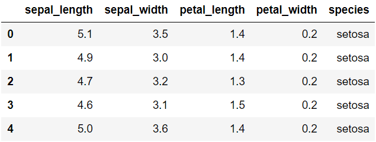

* 查看基本信息：

```python
iris.info()
"""
<class 'pandas.core.frame.DataFrame'>
RangeIndex: 150 entries, 0 to 149
Data columns (total 5 columns):
sepal_length    150 non-null float64
sepal_width     150 non-null float64
petal_length    150 non-null float64
petal_width     150 non-null float64
species         150 non-null object
dtypes: float64(4), object(1)
memory usage: 5.9+ KB
"""
```

* 查看基本描述：

```python
iris.describe()
```

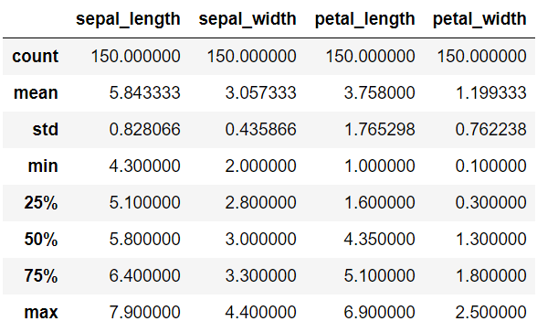

* 各个种类的数量：

```python
iris.species.value_counts()
"""
virginica     50
versicolor    50
setosa        50
Name: species, dtype: int64
"""
```

#### 绘制对比关系图

* 绘制参数之间关系的图：

```python
sns.pairplot(data=iris, hue="species")
```

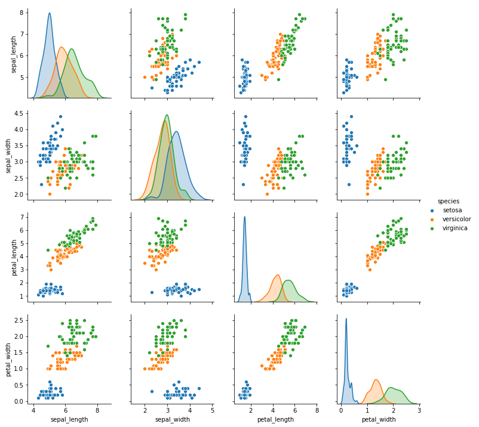


### 数据清洗与编码

#### 数据清洗

* 通过上述的对比关系图，可以看出 sepal_length、sepal_width 对分类的影响不大，因此我们这里为简化起见，去掉这两个参数。

```python
iris_simple = iris.drop(["sepal_length", "sepal_width"], axis=1)
iris_simple.head()
```

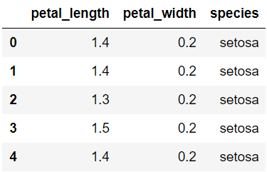

#### 数据编码

* 这里介绍 sklearn 库的预处理库 **preprocessing** 库的标签编码器 **LabelEncoder** 类。
* **LabelEncoder.fit_transform()**  该方法对数据进行数据标签编码（默认从0开始索引），并将标签编码返回。

```python
from sklearn.preprocessing import LabelEncoder

encoder = LabelEncoder()
iris_simple["species"] = encoder.fit_transform(iris_simple["species"])
iris_simple
```

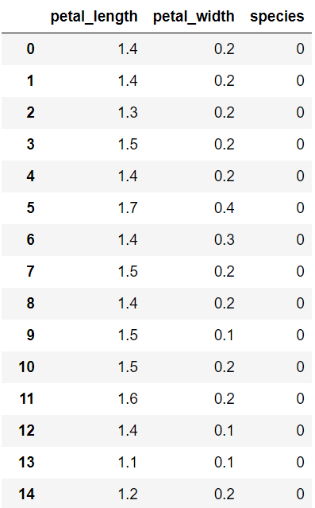

* 图片仅仅展示了一部分。后面的内容省略。


### 数据标准化

* （本数据集特征比较接近，实际处理过程中未标准化）
* 这里介绍 sklearn 库的预处理 **preprocessing** 库的数据标准化 **StandardScaler** 类。
* **StandardScaler.fit_transform()** 该方法对数据进行标准化，并返回标准化后的数据。

```python
from sklearn.preprocessing import StandardScaler
import pandas as pd

trans = StandardScaler()
_iris_simple = trans.fit_transform(iris_simple[["petal_length", "petal_width"]])
_iris_simple = pd.DataFrame(_iris_simple, columns = ["petal_length", "petal_width"])
_iris_simple.describe()
```

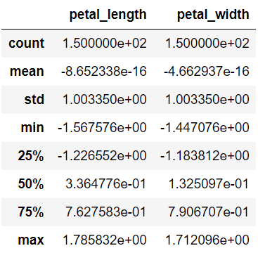


### 构建数据集

#### 训练集和测试集划分

* （为简便起见，本课暂不考虑验证集）
* 这里介绍 sklearn 库的模型选择 **model_selection** 库的数据集划分 **train_test_split** 方法。
* **train_test_split(dataset, test_size)** 该函数实现了对 dataset 数据集按照 test_size 比例划分。

```python
from sklearn.model_selection import train_test_split

train_set, test_set = train_test_split(iris_simple, test_size=0.2)
test_set.head()
```

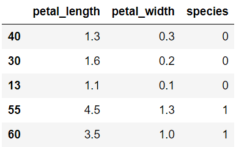

#### 特征数据和标签划分

* 将训练集和测试集分别划分成 x 和 y 两个部分的数据：

```python
iris_x_train = train_set[["petal_length", "petal_width"]]
iris_x_train.head()
```

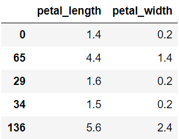

```python
iris_y_train = train_set["species"].copy()
iris_y_train.head()
"""
0      0
65     1
29     0
34     0
136    2
Name: species, dtype: int64
"""
```

```python
iris_x_test = test_set[["petal_length", "petal_width"]]
iris_x_test.head()
```

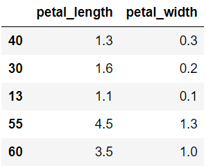

```python
iris_y_test = test_set["species"].copy()
iris_y_test.head()
"""
40    0
30    0
13    0
55    1
60    1
Name: species, dtype: int64
"""
```


## 机器学习调库通用方法

* sklearn 库的大部分模型都以类的形式给出，而且基本的操作模式都是一致的，仅仅存在一些调节参数的差异。下面我们先做一个总的介绍。需要注意，本章为简便起见，仅仅对结果进行一次训练，而不是重复训练。
* 本节将以 kNN（k近邻）模型为例进行说明。
* kNN算法的基本思想是，与待预测点最近的训练数据集中的k个邻居进行比较，把k个近邻中最常见的类别预测为带预测点的类别。

### 构建分类器对象

* 导入该模块：
  * **from sklearn.模块名 import 分类器类名** 从某个模块中导入分类器类

```python
from sklearn.neighbors import KNeighborsClassifier
```

* 初始化该对象：
  * **分类器对象 = 分类器类名(设置参数)** 根据初始分类器参数初始化分类器对象。若不设置参数则使用默认参数。
  * 在本章中我们将分类器对象统一设置为 **clf**（classifier）。后文介绍中的 clf 指的就是一个分类器对象。

```python
clf = KNeighborsClassifier()
clf
"""
KNeighborsClassifier(algorithm='auto', leaf_size=30, metric='minkowski',
           metric_params=None, n_jobs=1, n_neighbors=5, p=2,
           weights='uniform')
"""
```

### 训练模型

* **clf.fit(train_dataset_feature, train_dataset_label)** 对模型进行训练

```python
clf.fit(iris_x_train, iris_y_train)
"""
KNeighborsClassifier(algorithm='auto', leaf_size=30, metric='minkowski',
           metric_params=None, n_jobs=1, n_neighbors=5, p=2,
           weights='uniform')
"""
```

### 预测模型

* **clf.predict(test_dataset_feature)** 对测试集的特征进行预测

```python
res = clf.predict(iris_x_test)
print(res)
print(iris_y_test.values)
"""
[0 0 0 1 1 1 1 0 0 1 1 0 2 2 1 1 2 2 1 2 0 2 1 1 2 2 1 0 2 1]
[0 0 0 1 1 1 1 0 0 1 1 0 2 2 1 1 2 1 1 2 0 2 1 1 2 2 1 0 2 1]
"""
```

### 结果翻转

* 有时需要将数据标签和类别标签进行翻转，就会用到翻转函数：
* **encoder.inverse_tranform(res)** 翻转预测结果

```python
encoder.inverse_transform(res)
"""
array(['setosa', 'setosa', 'setosa', 'versicolor', 'versicolor',
       'versicolor', 'versicolor', 'setosa', 'setosa', 'versicolor',
       'versicolor', 'setosa', 'virginica', 'virginica', 'versicolor',
       'versicolor', 'virginica', 'virginica', 'versicolor', 'virginica',
       'setosa', 'virginica', 'versicolor', 'versicolor', 'virginica',
       'virginica', 'versicolor', 'setosa', 'virginica', 'versicolor'],
      dtype=object)
"""
```

### 准确率评估

* **clf.score(test_dataset_feature, test_dataset_label)** 计算得分（准确率）

```python
accuracy = clf.score(iris_x_test, iris_y_test)
print("预测正确率:{:.0%}".format(accuracy))
# 预测正确率:97%
```

### 可视化

* 可视化主要采用的还是上一章的可视化库：
  * 为了方便起见，我们直接定义一个可视化函数：

```python
import numpy as np
import matplotlib as mpl
import matplotlib.pyplot as plt

def draw(clf):

    # 网格化
    M, N = 500, 500
    x1_min, x2_min = iris_simple[["petal_length", "petal_width"]].min(axis=0)
    x1_max, x2_max = iris_simple[["petal_length", "petal_width"]].max(axis=0)
    t1 = np.linspace(x1_min, x1_max, M)
    t2 = np.linspace(x2_min, x2_max, N)
    x1, x2 = np.meshgrid(t1, t2)
    
    # 预测
    x_show = np.stack((x1.flat, x2.flat), axis=1)
    y_predict = clf.predict(x_show)
    
    # 配色
    cm_light = mpl.colors.ListedColormap(["#A0FFA0", "#FFA0A0", "#A0A0FF"])
    cm_dark = mpl.colors.ListedColormap(["g", "r", "b"])
    
    # 绘制预测区域图
    plt.figure(figsize=(10, 6))
    plt.pcolormesh(t1, t2, y_predict.reshape(x1.shape), cmap=cm_light)
    
    # 绘制原始数据点
    plt.scatter(iris_simple["petal_length"], iris_simple["petal_width"], label=None,
                c=iris_simple["species"], cmap=cm_dark, marker='o', edgecolors='k')
    plt.xlabel("petal_length")
    plt.ylabel("petal_width")
    
    # 绘制图例
    color = ["g", "r", "b"]
    species = ["setosa", "virginica", "versicolor"]
    for i in range(3):
        plt.scatter([], [], c=color[i], s=40, label=species[i])    # 利用空点绘制图例
    plt.legend(loc="best")
    plt.title('iris_classfier')
```

```python
draw(clf)
```

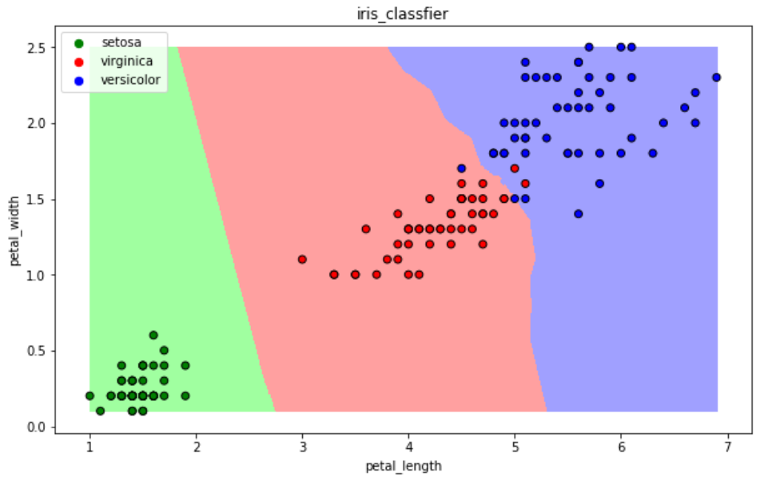

### 存储数据

* 将结果输出成一个 DataFrame：

```python
out = iris_x_test.copy()
out["y"] = iris_y_test
out["pre"] = res
out
```

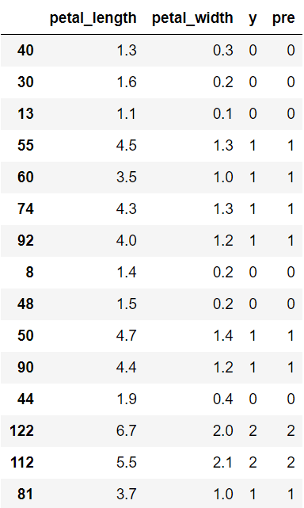

* **out.to_csv("filename")** 将结果存储到 csv 文件中
  * **pd.read_csv("filename")** 从 csv 文件中读取结果

```python
out.to_csv()
```


### 总结

* 以上就是机器学习的一种通用分析方法，后面我们将对所有模型过一遍这一方法。就不重新介绍该方法了。


## K 近邻算法

* 该算法就是刚刚做例子的那个算法。这里重新整体写一遍，如果已经完全理解可以跳过。

### 基本原理

* 与待预测点最近的训练数据集中的k个邻居，
* 把k个近邻中最常见的类别预测为带预测点的类别。

### 初始化

```python
from sklearn.neighbors import KNeighborsClassifier

# 构建分类器
clf = KNeighborsClassifier()
clf
"""
KNeighborsClassifier(algorithm='auto', leaf_size=30, metric='minkowski',
           metric_params=None, n_jobs=1, n_neighbors=5, p=2,
           weights='uniform')
"""
```

### 训练与预测

```python
# 训练
clf.fit(iris_x_train, iris_y_train)
"""
KNeighborsClassifier(algorithm='auto', leaf_size=30, metric='minkowski',
           metric_params=None, n_jobs=1, n_neighbors=5, p=2,
           weights='uniform')
"""

# 预测
res = clf.predict(iris_x_test)
print(res)
print(iris_y_test.values)
"""
[0 0 0 1 1 1 1 0 0 1 1 0 2 2 1 1 2 2 1 2 0 2 1 1 2 2 1 0 2 1]
[0 0 0 1 1 1 1 0 0 1 1 0 2 2 1 1 2 1 1 2 0 2 1 1 2 2 1 0 2 1]
"""
```

### 评价与可视化

```python
# 评价
accuracy = clf.score(iris_x_test, iris_y_test)
print("预测正确率:{:.0%}".format(accuracy))
# 预测正确率:97%

# 可视化
draw(clf)
```


## 朴素贝叶斯算法

### 基本原理

* 当X=(x1, x2)发生的时候，哪一个yk发生的概率最大。

### 初始化

```python
from sklearn.naive_bayes import GaussianNB

# 构建分类器
clf = GaussianNB()
clf
"""
GaussianNB(priors=None)
"""
```

### 训练与预测

```python
# 训练
clf.fit(iris_x_train, iris_y_train)
"""
GaussianNB(priors=None)
"""

# 预测
res = clf.predict(iris_x_test)
print(res)
print(iris_y_test.values)
"""
[0 0 0 1 1 1 1 0 0 1 1 0 2 2 1 1 2 2 1 2 0 2 1 1 2 2 1 0 2 1]
[0 0 0 1 1 1 1 0 0 1 1 0 2 2 1 1 2 1 1 2 0 2 1 1 2 2 1 0 2 1]
"""
```

### 评价与可视化

```python
# 评价
accuracy = clf.score(iris_x_test, iris_y_test)
print("预测正确率:{:.0%}".format(accuracy))
# 预测正确率:97%

# 可视化
draw(clf)
```

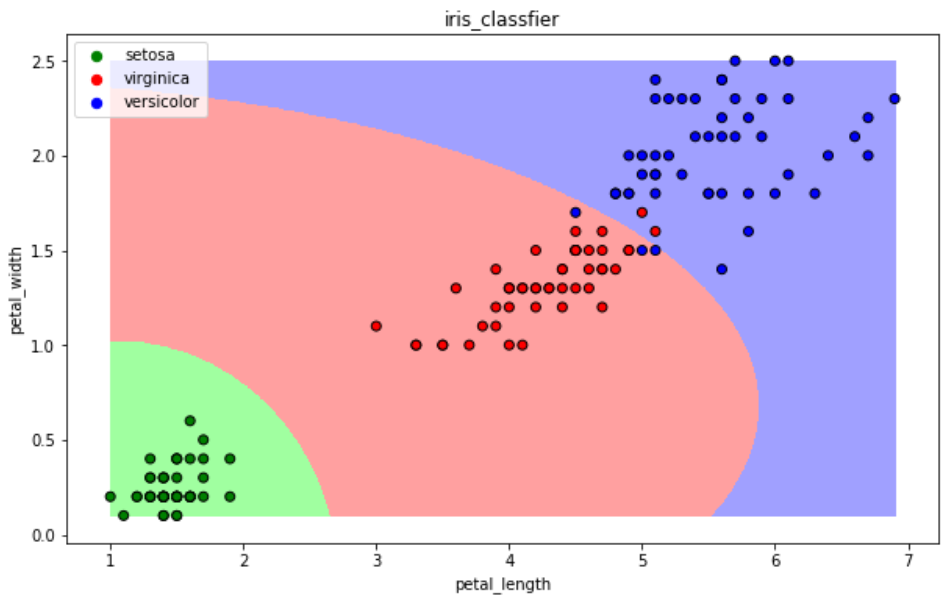


## 决策树算法

### 基本原理

* CART算法：每次通过一个特征，将数据尽可能的分为纯净的两类，递归的分下去

### 初始化

```python
from sklearn.tree import DecisionTreeClassifier

# 构建分类器
clf = DecisionTreeClassifier()
clf
"""
DecisionTreeClassifier(class_weight=None, criterion='gini', max_depth=None,
            max_features=None, max_leaf_nodes=None,
            min_impurity_decrease=0.0, min_impurity_split=None,
            min_samples_leaf=1, min_samples_split=2,
            min_weight_fraction_leaf=0.0, presort=False, random_state=None,
            splitter='best')
"""
```

### 训练与预测

```python
# 训练
clf.fit(iris_x_train, iris_y_train)
"""
DecisionTreeClassifier(class_weight=None, criterion='gini', max_depth=None,
            max_features=None, max_leaf_nodes=None,
            min_impurity_decrease=0.0, min_impurity_split=None,
            min_samples_leaf=1, min_samples_split=2,
            min_weight_fraction_leaf=0.0, presort=False, random_state=None,
            splitter='best')
"""

# 预测
res = clf.predict(iris_x_test)
print(res)
print(iris_y_test.values)
"""
[0 0 0 1 1 1 1 0 0 1 1 0 2 2 1 1 1 1 1 2 0 2 1 1 2 2 1 0 2 1]
[0 0 0 1 1 1 1 0 0 1 1 0 2 2 1 1 2 1 1 2 0 2 1 1 2 2 1 0 2 1]
"""
```

### 评价与可视化

```python
# 评价
accuracy = clf.score(iris_x_test, iris_y_test)
print("预测正确率:{:.0%}".format(accuracy))
# 预测正确率:97%

# 可视化
draw(clf)
```

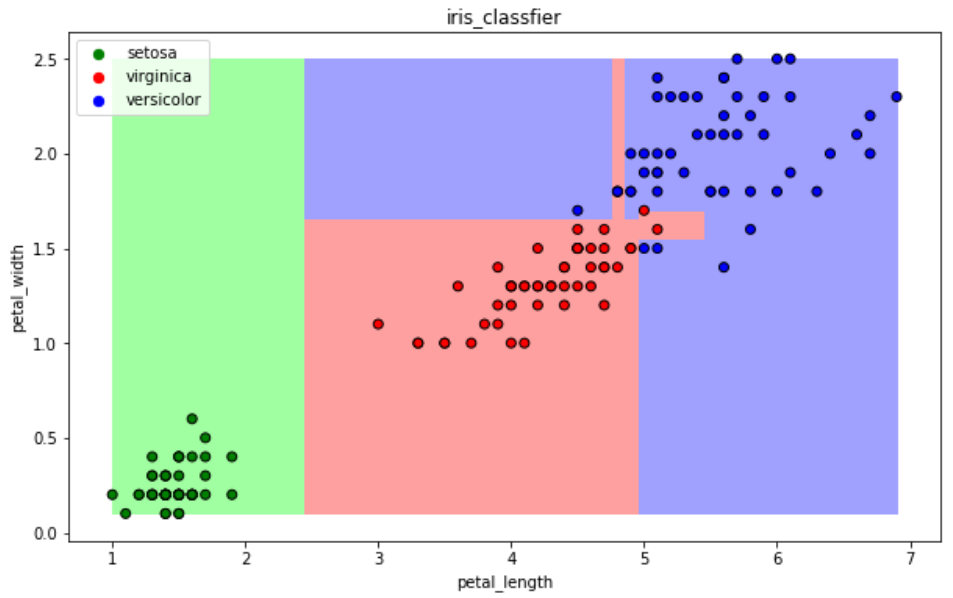


## 逻辑回归算法

* 一种解释：
* 训练：通过一个映射方式，将特征X=（x1, x2） 映射成 P(y=ck), 求使得所有概率之积最大化的映射方式里的参数
* 预测：计算p(y=ck) 取概率最大的那个类别作为预测对象的分类

### 初始化

```python
from sklearn.linear_model import LogisticRegression

# 构建分类器
clf = LogisticRegression(solver='saga', max_iter=1000)
clf
"""
LogisticRegression(C=1.0, class_weight=None, dual=False, fit_intercept=True,
          intercept_scaling=1, max_iter=1000, multi_class='ovr', n_jobs=1,
          penalty='l2', random_state=None, solver='saga', tol=0.0001,
          verbose=0, warm_start=False)
"""
```

### 训练与预测

```python
# 训练
clf.fit(iris_x_train, iris_y_train)
"""
LogisticRegression(C=1.0, class_weight=None, dual=False, fit_intercept=True,
          intercept_scaling=1, max_iter=1000, multi_class='ovr', n_jobs=1,
          penalty='l2', random_state=None, solver='saga', tol=0.0001,
          verbose=0, warm_start=False)
"""

# 预测
res = clf.predict(iris_x_test)
print(res)
print(iris_y_test.values)
"""
[0 0 0 1 1 1 1 0 0 1 1 0 2 2 1 1 2 2 1 2 0 2 2 1 2 2 1 0 2 1]
[0 0 0 1 1 1 1 0 0 1 1 0 2 2 1 1 2 1 1 2 0 2 1 1 2 2 1 0 2 1]
"""
```

### 评价与可视化

```python
# 评价
accuracy = clf.score(iris_x_test, iris_y_test)
print("预测正确率:{:.0%}".format(accuracy))
# 预测正确率:93%

# 可视化
draw(clf)
```

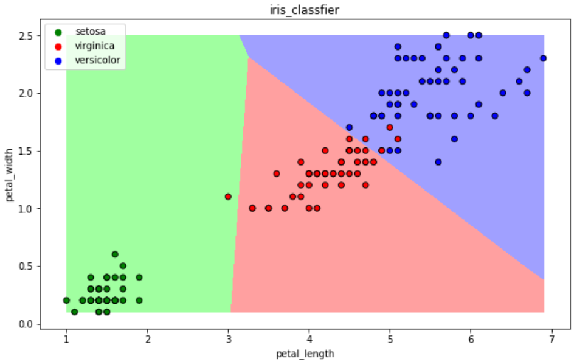


## 支持向量机算法

* 以二分类为例，假设数据可用完全分开：
* 用一个超平面将两类数据完全分开，且最近点到平面的距离最大

### 初始化

```python
from sklearn.svm import SVC

# 构建分类器
clf = SVC()
clf
"""
SVC(C=1.0, cache_size=200, class_weight=None, coef0=0.0,
  decision_function_shape='ovr', degree=3, gamma='auto', kernel='rbf',
  max_iter=-1, probability=False, random_state=None, shrinking=True,
  tol=0.001, verbose=False)
"""
```

### 训练与预测

```python
# 训练
clf.fit(iris_x_train, iris_y_train)
"""
SVC(C=1.0, cache_size=200, class_weight=None, coef0=0.0,
  decision_function_shape='ovr', degree=3, gamma='auto', kernel='rbf',
  max_iter=-1, probability=False, random_state=None, shrinking=True,
  tol=0.001, verbose=False)
"""

# 预测
res = clf.predict(iris_x_test)
print(res)
print(iris_y_test.values)
"""
[0 0 0 1 1 1 1 0 0 1 1 0 2 2 1 1 2 2 1 2 0 2 1 1 2 2 1 0 2 1]
[0 0 0 1 1 1 1 0 0 1 1 0 2 2 1 1 2 1 1 2 0 2 1 1 2 2 1 0 2 1]
"""
```

### 评价与可视化

```python
# 评价
accuracy = clf.score(iris_x_test, iris_y_test)
print("预测正确率:{:.0%}".format(accuracy))
# 预测正确率:97%

# 可视化
draw(clf)
```

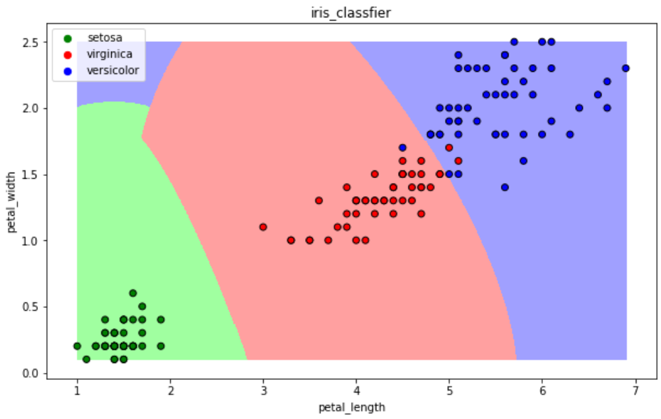


## 集成方法 —— 随机森林

* 训练集m，有放回的随机抽取m个数据，构成一组，共抽取n组采样集
* n组采样集训练得到n个弱分类器   弱分类器一般用决策树或神经网络
* 将n个弱分类器进行组合得到强分类器

### 初始化

```python
from sklearn.ensemble import RandomForestClassifier

# 构建分类器
clf = RandomForestClassifier()
clf
"""
RandomForestClassifier(bootstrap=True, class_weight=None, criterion='gini',
            max_depth=None, max_features='auto', max_leaf_nodes=None,
            min_impurity_decrease=0.0, min_impurity_split=None,
            min_samples_leaf=1, min_samples_split=2,
            min_weight_fraction_leaf=0.0, n_estimators=10, n_jobs=1,
            oob_score=False, random_state=None, verbose=0,
            warm_start=False)
"""
```

### 训练与预测

```python
# 训练
clf.fit(iris_x_train, iris_y_train)
"""
RandomForestClassifier(bootstrap=True, class_weight=None, criterion='gini',
            max_depth=None, max_features='auto', max_leaf_nodes=None,
            min_impurity_decrease=0.0, min_impurity_split=None,
            min_samples_leaf=1, min_samples_split=2,
            min_weight_fraction_leaf=0.0, n_estimators=10, n_jobs=1,
            oob_score=False, random_state=None, verbose=0,
            warm_start=False)
"""

# 预测
res = clf.predict(iris_x_test)
print(res)
print(iris_y_test.values)
"""
[0 0 0 1 1 1 1 0 0 1 1 0 2 2 1 1 2 2 1 2 0 2 1 1 2 2 1 0 2 1]
[0 0 0 1 1 1 1 0 0 1 1 0 2 2 1 1 2 1 1 2 0 2 1 1 2 2 1 0 2 1]
"""
```

### 评价与可视化

```python
# 评价
accuracy = clf.score(iris_x_test, iris_y_test)
print("预测正确率:{:.0%}".format(accuracy))
# 预测正确率:97%

# 可视化
draw(clf)
```

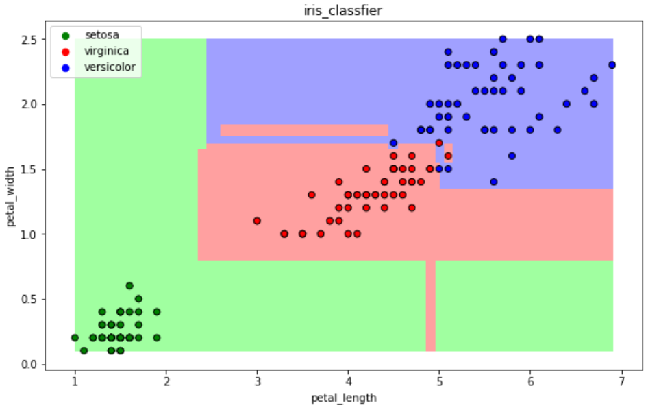


## 集成方法 —— Adaboost

* 训练集m，用初始数据权重训练得到第一个弱分类器，根据误差率计算弱分类器系数，更新数据的权重
* 使用新的权重训练得到第二个弱分类器，以此类推
* 根据各自系数，将所有弱分类器加权求和获得强分类器

### 初始化

```python
from sklearn.ensemble import AdaBoostClassifier

# 构建分类器
clf = AdaBoostClassifier()
clf
"""
AdaBoostClassifier(algorithm='SAMME.R', base_estimator=None,
          learning_rate=1.0, n_estimators=50, random_state=None)
"""
```

### 训练与预测

```python
# 训练
clf.fit(iris_x_train, iris_y_train)
"""
AdaBoostClassifier(algorithm='SAMME.R', base_estimator=None,
          learning_rate=1.0, n_estimators=50, random_state=None)
"""

# 预测
res = clf.predict(iris_x_test)
print(res)
print(iris_y_test.values)
"""
[0 0 0 1 1 1 1 0 0 1 1 0 2 2 1 1 1 2 1 2 0 2 1 1 2 2 1 0 2 1]
[0 0 0 1 1 1 1 0 0 1 1 0 2 2 1 1 2 1 1 2 0 2 1 1 2 2 1 0 2 1]
"""
```

### 评价与可视化

```python
# 评价
accuracy = clf.score(iris_x_test, iris_y_test)
print("预测正确率:{:.0%}".format(accuracy))
# 预测正确率:93%

# 可视化
draw(clf)
```

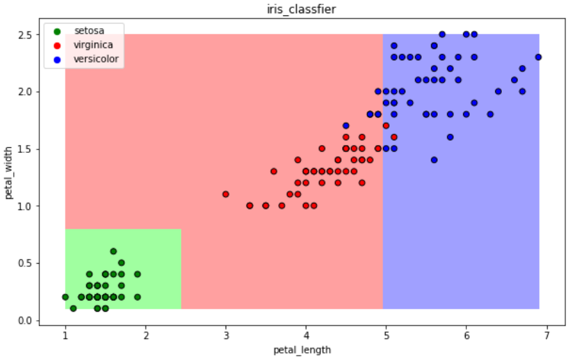


## 集成方法 —— 梯度提升树GBDT

* 训练集m，获得第一个弱分类器，获得残差，然后不断地拟合残差
* 所有弱分类器相加得到强分类器

### 初始化

```python
from sklearn.ensemble import GradientBoostingClassifier

# 构建分类器
clf = GradientBoostingClassifier()
clf
"""
GradientBoostingClassifier(criterion='friedman_mse', init=None,
              learning_rate=0.1, loss='deviance', max_depth=3,
              max_features=None, max_leaf_nodes=None,
              min_impurity_decrease=0.0, min_impurity_split=None,
              min_samples_leaf=1, min_samples_split=2,
              min_weight_fraction_leaf=0.0, n_estimators=100,
              presort='auto', random_state=None, subsample=1.0, verbose=0,
              warm_start=False)
"""
```

### 训练与预测

```python
# 训练
clf.fit(iris_x_train, iris_y_train)
"""
GradientBoostingClassifier(criterion='friedman_mse', init=None,
              learning_rate=0.1, loss='deviance', max_depth=3,
              max_features=None, max_leaf_nodes=None,
              min_impurity_decrease=0.0, min_impurity_split=None,
              min_samples_leaf=1, min_samples_split=2,
              min_weight_fraction_leaf=0.0, n_estimators=100,
              presort='auto', random_state=None, subsample=1.0, verbose=0,
              warm_start=False)
"""

# 预测
res = clf.predict(iris_x_test)
print(res)
print(iris_y_test.values)
"""
[0 0 0 1 1 1 1 0 0 1 1 0 2 2 1 1 2 2 1 2 0 2 1 1 2 2 1 0 2 1]
[0 0 0 1 1 1 1 0 0 1 1 0 2 2 1 1 2 1 1 2 0 2 1 1 2 2 1 0 2 1]
"""
```

### 评价与可视化

```python
# 评价
accuracy = clf.score(iris_x_test, iris_y_test)
print("预测正确率:{:.0%}".format(accuracy))
# 预测正确率:97%

# 可视化
draw(clf)
```

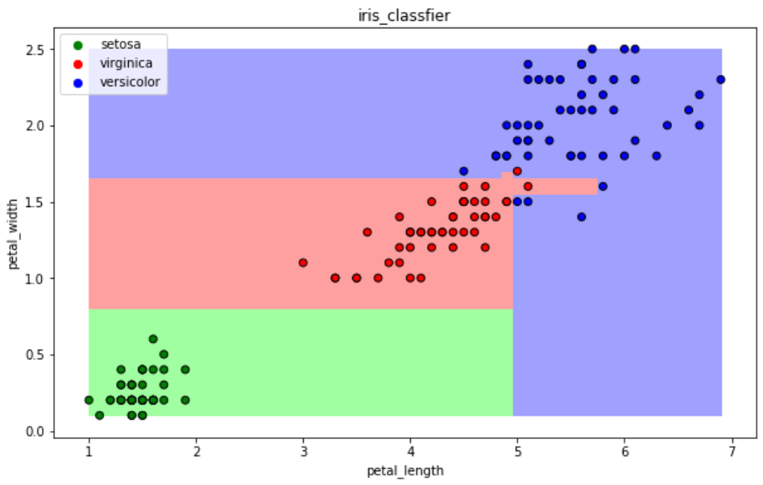


## 后续

* 最后我们简单介绍一些现代的机器学习算法：

### Xgboost

* GBDT的损失函数只对误差部分做负梯度（一阶泰勒）展开
* XGBoost损失函数对误差部分做二阶泰勒展开，更加准确，更快收敛

### Lightgbm

* 微软：快速的，分布式的，高性能的基于决策树算法的梯度提升框架
* 速度更快

### Stacking

* 堆叠或者叫模型融合
* 先建立几个简单的模型进行训练，第二级学习器会基于前级模型的预测结果进行再训练

### 神经网络

* 较复杂，后续介绍。


* 其他内容请参考官方文档：
* Written by：Sirius. Lu
* Reference：深度之眼  python基础训练营
* 2020.7.11