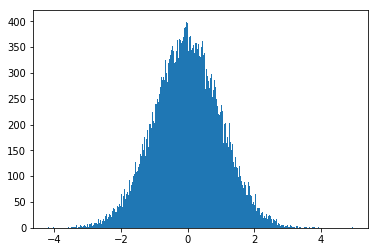

# Python 学习笔记（三）模块与标准库

* 本笔记 # 后为该语句的输出结果，或该变量的值。若 # 后接 ! 号，意思是该语句不能这样写。
* 对于多行的输出结果，我会用""" """进行注释。
* 对于一些输出结果，笔记中为方便理解会在一个代码块写出所有的输出语句，实际调试中应该仅保留一个输出语句（格式化输出print除外），否则前面的输出会被最后一个输出语句覆盖。


* 本笔记（以及之后的笔记）将对Python的常用模块进行详细叙述，将从模块调用、python内置模块到常用的numpy、pandas、matplotlib模块等一一介绍。本笔记的内容主要基于深度之眼的Python基础训练营课程，在顺序和例子上面进行了一些修改和总结。
* 本文对Python的基本语法特性将不做详细回顾，因此对于Python的基本语法的请参看笔记（一）基础编程和笔记（二）高级编程。
* 本笔记主要介绍Python的模块使用方法，以及内置函数和标准库。之后的笔记将介绍第三方库。


目录

[toc]


## 模块总述

* 模块也称包、库，是一种已经被封装好的一部分代码，专门用于解决一个特定问题。它可能是一个单独的.py文件，也可能是多个python文件的组合。有了模块，我们在使用一些代码的时候就不用从头写起，可以直接使用别人的函数和类，进而站在巨人的肩膀上前行。许多热门的算法和框架都是以模块的形式使用的。
* 那么我们现在来学习如何调用和使用模块。


### 模块的分类

* 广义的模块可分为：python内置库、第三方库、自定义库等。

#### python内置库

* 顾名思义，python自带的一些库，无需安装，只要导入（声明）一下就可以使用，如 time (时间库) 、random (随机库)、collection (容器数据类型) 、 itertools (迭代器函数)等。

#### 第三方库

* 第三方库是一些公司或机构编写并发表的供他人学习使用的开源库，这样的库数量及其庞大，我们简单介绍几个：
* numpy、pandas（数据分析库）、matplotlib（数据可视化库）、scikit-learn（机器学习库）、Tensorflow（深度学习框架）

#### 自定义文件

* 我们也可以自己定义自己的库，可以使用单个py文件，或者使用多个py文件构成包。
* 如果文件夹内有多个py文件，需要再加一个--init--.py文件（内容可为空，前面的-符号应该是_，因为笔记中__打不出来）。


### 模块导入

#### 导入整个模块

* 导入模块方式：**import  模块名**
* 调用方式：模块名.函数名或类名
* 下面是一个导入内置库time实现程序计时的例子：

```python
import time # 导入 time 模块

start = time.time() # 调用time模块的time()函数，输出结果返回给start变量
time.sleep(3) # 调用time模块的sleep()函数
end = time.time() # 再次调用time()函数

print('程序运行用时：{:.2f}秒'.format(end-start)) # 获得该程序执行的时间
```

* 下面是一个导入自定义库的例子：

```python
import fun1 # 导入自己定义的fun1模块
fun1.f1() # 调用自己定义的f1()函数
```

#### 从模块中导入类或函数

* 导入模块方式：**from 模块名 import 类名或函数名**
* 调用方式：函数名或类名
* 下面是一个导入内置库itertools中product函数的例子，该函数对两个对象做笛卡尔积并用元组返回。

```python
from itertools import product # 从itertools库中导入product函数

ls = list(product('AB', '123')) # 直接调用product函数
print(ls) # [('A', '1'), ('A', '2'), ('A', '3'), ('B', '1'), ('B', '2'), ('B', '3')]
```

* 下面是一个导入自定义模块的例子。需要注意这里function是一个文件夹（也可以看成是一个模块），fun1是function文件夹中的一个.py文件。

```python
from function.fun1 import f1 # 从function文件夹的fun1.py文件中导入函数f1

f1() # 调用f1
```

* 该方法支持一次导入多个函数或多个文件：

```python
from function import fun1, fun2 # 从function文件夹的fun1.py和fun2.py两个文件中的导入所有函数

fun1.f1() # 调用fun1.py文件中的f1()函数
fun2.f1() # 调用fun2.py文件中的f2()函数
```

#### 导入模块中的所有类和函数

* 导入模块方式：**from 模块名 import ***

* 调用方式：函数名或类名

* 下面给出一个random模块的调用例子：

```python
from random import *

print(randint(1, 100)) # 产生一个[1, 100]之间的随机整数
print(random()) # 产生一个[0, 1)之间的随机小数
```


### 模块的查找路径

* 下面给出系统在导入模块时的查找路径，通过路径的学习可以有效规避一些查找问题。

#### 1、内存中已加载模块

* 系统会首先搜索系统中有没有已加载这个模块，如果有，则直接导入。
* 这一机制会带来一个问题。那就是如果我们在内存中已经加载好这个模块了，对模块在硬盘上进行修改或删除，是**不会起作用的**。
* 下面的例子展示了这个现象：

```python
import fun1
fun1.f1() # 第一次调用

# 此时修改硬盘上的fun1模块文件
import fun1 # 可以执行，因为内存上已经加载好这个模块了
fun1.f1() # 第二次调用，依然可以调用，会产生和第一次调用一样的结果。

# 此时删除硬盘上的fun1模块文件
import fun1 # 可以执行，因为内存上已经加载好这个模块了
fun1.f1() # 第三次调用，依然可以调用，会产生和第一次调用一样的结果。
```

#### 2、内置模块（built-in）

* python在启动时，解释器会默认加载一些模块存放在sys.modules中。
* sys.modules 变量是一个当前载入解释器的模块组成的字典，该字典以模块名为键，他们的位置为值。

```python
import sys

print(len(sys.modules)) # 打印已加载的模块数
print("math" in sys.modules) # 判断是否在模块中
print("numpy" in sys.modules)
```

#### 3、sys.path路径中包含的模块

* sys模块中有一个path变量，该变量是由许多路径组成的列表。系统会到这些列表中查找所需的模块。

```python
import sys

sys.path # 显示所有系统路径
```

* sys.path 的第一个路径是当前执行文件所在的文件夹。


### 其他模块的导入

* 如果一个模块不在系统的查找路径内，也不在系统路径中，那么我们又想使用这个模块，该怎么办呢？
* 我们可以将这个模块的路径添加到系统路径中。添加的方法如下：

```python
import sys

sys.path.append('C:\\Users\\Twist\\Desktop') # windows的路径都是双斜杠。不同电脑路径会有不同。

import fun3

fun3.f3()
```

* 以上我们就完成了对模块使用方法的基本了解。


## time：用于处理时间的标准库

### 获取时间

* **time.localtime()**  获取本地时间（如在中国，获取北京时间）
  * localtime() 函数默认从1970年1月1日8时0分0秒（称为the Epoch）开始计时。
  * localtime() 可以接受一个整型数字参数seconds，该数字反映的是所需要得到的时刻相对于 the Epoch 有多少秒。
  * 若不给出该参数，则默认使用现在的时间作为参数。
  * localtime() 函数返回一个时间元组类型数据，将会清晰地显示现在的时间信息（年月日时分秒等）

* **time.gmtime()** UTC世界统一时间
  * gmtime() 的用法和 localtime 完全一致，只不过显示的是世界同一时间。
  * 北京时间比世界统一时间早8个小时。
  * 例子：

```python
import time 

t_local = time.localtime()
t_UTC = time.gmtime()
print(t_local)
# time.struct_time(tm_year=2020, tm_mon=6, tm_mday=19, tm_hour=23, tm_min=24, tm_sec=33, tm_wday=4, tm_yday=171, tm_isdst=0) 显示了年、月、日、时、分、秒等信息
print(t_UTC)
# time.struct_time(tm_year=2020, tm_mon=6, tm_mday=19, tm_hour=15, tm_min=24, tm_sec=33, tm_wday=4, tm_yday=171, tm_isdst=0)
```

* 有时我们仅仅需要一个简单的时间，不用那么复杂，那么我们可以用 **time.ctime()** 函数获取一个本地时间的简单字符串。

  * ctime() 函数与 localtime、gmtime 完全一致，只不过返回的是一个字符串形式。

```python
time.ctime() # 'Fri Jun 19 23:27:49 2020'
```


### 时间戳

* 时间戳函数的设计是为了实现计时器的功能。我们很多时候需要知道程序大概要运行多久，那么我们可以通过时间戳来进行设计。

* **time.time()**   返回自纪元以来的秒数。
  * time() 函数返回的秒数是一个浮点型数据。小数部分是代表一秒内的精度。

* **time.perf_counter()**   随意选取一个时间点，记录现在到该时间的秒数。较 time.time() 精度稍高一些。
  * perf_counter 的全称是 performance counter（性能计数器），大概指的是从一个固定时间点开始提取一个秒数。
  * 每次调用 perf_counter 都会提取一次秒数。从而可以实现计时。

* **time.process_time()**   随意选取一个时间点，记录现在到该时间的秒数。和上一个函数的区别是，不会将系统休眠时间算入。
  * 该函数每次返回的时间其实不完全是随便取的，而是 kernel 和 CPU 的使用时间之和。

* 需要注意的是，这些时间戳每次使用时随意选取仅仅在第一次调用时随机选，但是后续调用时依然按照第一次选取的时间进行。（否则就没法进行计时了嘛）。

* 下面给出一个小例子：

```python
t_1_start = time.time()
t_2_start = time.perf_counter()
t_3_start = time.process_time()
print(t_1_start) # 1592580969.8131123
print(t_2_start) # 5.5e-06
print(t_3_start) # 1.796875

res = 0
for i in range(1000000):
    res += i
    
time.sleep(5)
t_1_end = time.time()
t_2_end = time.perf_counter()
t_3_end = time.process_time()

print("time方法：{:.3f}秒".format(t_1_end-t_1_start)) # time方法：5.147秒
print("perf_counter方法：{:.3f}秒".format(t_2_end-t_2_start)) # perf_counter方法：5.147秒
print("process_time方法：{:.3f}秒".format(t_3_end-t_3_start)) # process_time方法：0.172秒
```

明显可以看出，process_time减去了休眠的大概5秒钟。


### 自定义格式化输出

* **time.strftime()**  该函数可以自定义时间格式输出：
  * 首先输入一个格式字符串代表所需格式（具体格式请参看帮助文档），以及一个时间元组，就能按照这个格式输出。若不提供元组信息，那么就会使用 localtime 输出。
  * 请参看帮助文档获取详细信息。

```python
lctime = time.localtime()
time.strftime("%Y-%m-%d %A %H:%M:%S", lctime) # '2020-06-19 Friday 23:38:42'
```


### 睡觉觉

* 利用 **time.sleep(seconds)** 函数可以实现一定时间的系统休眠。上面的例子已经演示过了。sleep函数需要提供一个参数，可以设定睡眠时间。


## random：用于获取随机化数据的标准库

* Python产生的随机数依然是伪随机数，即根据随机化种子生成。所以从某种意义上来说具有确定性。
* random库中的random是一个类，方法中有的静态方法也可以直接调用。

### 基本随机化

#### 随机数种子

* **random.seed()** 


* seed() 方法用于初始化随机数种子。通过初始化该种子，可实现对其他初始化函数的随机化。
* 如果不给出随机化种子，则按照系统时间初始化。每做完一次随机数提取后，应该重新初始化该种子。
* 需要注意的是，对于同一个随机化函数，如果随机数种子也一致，那么函数得到的结果也一致。

#### 随机数产生

* **random.random()**

  * random() 方法用于产生一个0~1之间的随机数。下面我们用这个方法与seed结合验证一下刚才的结论：

  ```python
  import random
  random.seed(10) # 初始化种子为10
  random.random() # 0.5714025946899135
  random.seed(10) # 初始化种子为10
  random.random() # 0.5714025946899135 产生的随机数不变
  ```


### 随机整数

* **random.randint(a, b)**

  * randint() 方法返回一个 [a, b] 之间的随机整数，包括两端点。
  * 给出一个小例子：

  ```python
  import random
  
  numbers = [random.randint(0, 10) for i in range(10)]
  numbers
  # [9, 0, 3, 7, 7, 4, 10, 2, 0, 8]
  ```

* **random.randrange(a)** 

  * randrange(a) 方法产生一个 [0, a) 之间的随机整数，不包括右端点。
  * 给出一个小例子：

  ```python
  import random
  
  numbers = [random.randrange(10) for i in range(10)]
  numbers
  # [7, 5, 1, 3, 5, 0, 6, 2, 9, 5]
  ```

  * randrange(a, b) 方法产生一个 [a, b) 之间的随机整数，不包括右端点。
  * randrange(a, b, step) 方法产生一个按照 step 步长划分的 [a, b) 之间的随机整数，不包括右端点。


### 随机浮点数

* **random.random()** 产生 (0.0, 1.0) 之间的随机浮点数。
* **random.uniform(a, b)** 产生 [a, b] 之间的随机浮点数。
* 上述两者都符合均匀分布。用法和整数几乎一致，略。


### 序列用函数

#### 随机取样

* **random.choice(seq)**  从序列类型中随机取一个元素

  * 常见用法：

  ```python
  import random
  
  random.choice(['win', 'lose', 'draw']) # 'draw'  在列表元素中随便取一个
  ```

* **random.choices(population, weights, k)**

  * population参数和seq差不多，weights参数可以给出每个元素的相对权重，cum_weights是累积权重（两者给一个即可）。
  * k代表的是返回的随机选择的数量。可以根据所需要的选择结果进行修改。默认返回一个。

  ```python
  import random
  
  random.choices(['win', 'lose', 'draw'], k=5) # ['lose', 'win', 'draw', 'lose', 'draw']
  random.choices(['win', 'lose', 'draw'], weights = [4,4,1], k=5)
  # ['draw', 'win', 'lose', 'win', 'lose']
  ```

#### 随机打乱

* **random.shuffle(seq)** 将一个序列数据打乱

  * 小例子：

  ```python
  numbers = ['one', 'two', 'three', 'four']
  random.shuffle(numbers)
  numbers # ['one', 'four', 'two', 'three']
  ```

#### 不放回随机抽样

* **random.sample(population, k)**

  * population为序列，k为抽样的个数。
  * 小例子：

  ```python
  random.sample([10, 20, 30, 40, 50], 3) # [20, 30, 50]
  ```


### 概率分布

* 产生高斯分布随机数：
* **random.gauss(mean, std)**  产生一个符合高斯分布的随机数。
* 小例子：

```python
number = random.gauss(0, 1)
number # -0.860007653790428
```

* 产生多个随机数并画直方图：

```python
import matplotlib.pyplot as plt

res = [gauss(0, 1) for i in range(100000)]
plt.hist(res, bins = 1000)
plt.show()
```




### 使用random库的小例子

#### 分配红包

* 模拟微信上给人分配不同金额的红包。期望意义上大家的分配金额都一致。

```python
import random

def red_packet(total, num):
    for i in range(1, num):
        per = random.uniform(0.01, total/(num-i+1)*2)
        total = total - per
        print("第{}位红包金额：{:.2f}元".format(i, per))
    else:
        print("第{}位红包金额：{:.2f}元".format(num, total))
        
red_packet(5, 10)
```

#### 验证码生成

* 模拟生成4位由数字和字母组成的验证码。

```python
import random
import string

print(string.digits) # 数字字符
print(string.ascii_letters) # 字母字符

s = string.digits + string.ascii_letters
v = random.sample(s, 4)

print(v) # 打印4个字符
print(''.join(v)) # 聚合输出
```


## collections：提供不同的容器（数据类型）

* 该库可以看成是数据类型的扩展。

### 具名元组 namedtuple

#### 定义

* 故名思义，具名元组，应该和**元组**有关。

* 如果我们需要表达一个点坐标，但是仅根据数据很难表示，如：

```python
p = (1, 2)
```

* 我们可以给每一个值一个名字，这样产生的元组就是具名元组。
* 具名元组的定义方法如下：

```
collections.namedtuple(typename, field_names, ...)
```

* typename是元组名字，field_names是域名。

```python
_Point = collections.namedtuple('Point', ['x', 'y'])
p = _Point(1, y=2)
p # Point(x=1, y=2)
```

* 上例中_Point和Point只是为了区分变量的不同。实际应用中可以采用相同的变量。

#### 性质与属性

* 调用属性

```python
p.x # 1
p.y # 2
```

* 具备元组的性质

```python
p[0] # 1
p[1] # 2
x, y = p # 解包赋值
x # 1
y # 2
```

* 是元组的子类？

```python
isinstance(p, tuple) # True
```

#### 使用

* 模拟扑克牌

```python 
Card = collections.namedtuple('Card', ['rank', 'suit'])
ranks = [str(n) for n in range(2, 11)] + list('JQKA')
suits = 'spades diamonds clubs hearts'.split()

print('ranks', ranks)
# ranks ['2', '3', '4', '5', '6', '7', '8', '9', '10', 'J', 'Q', 'K', 'A']
print('suits', suits)
# suits ['spades', 'diamonds', 'clubs', 'hearts']

cards = [Card(rank, suit) for rank in ranks
                          for suit in suits]
cards

"""
 [Card(rank='2', suit='spades'),
 Card(rank='2', suit='diamonds'),
 Card(rank='2', suit='clubs'),
 Card(rank='2', suit='hearts'),
 Card(rank='3', suit='spades'),
 ... ]
"""

from random import *

shuffle(cards) # 洗牌
choice(cards) # 随机抽一张牌
sample(cards, k=5) # 随机抽取多张牌
```


### 计数器工具 Counter

#### 引例

* 小例子：统计单词出现次数

```python
from collections import Counter

s = '牛奶奶找刘奶奶买牛奶'
colors = ['red', 'blue', 'red', 'green', 'blue', 'blue']

cnt_str = Counter(s)
cnt_color = Counter(colors)
print(cnt_str)
# Counter({'奶': 5, '牛': 2, '找': 1, '刘': 1, '买': 1})
print(cnt_color)
# Counter({'blue': 3, 'red': 2, 'green': 1})
```

* 实际上，计数器工具是**字典**的一个子类：

```python
print(isinstance(Counter(), dict)) # True
```

#### 常用方法

* 最高频率统计：**most_common(n)**

    * 提供n个频率最高的元素和计数。

    ```python
    cnt_color.most_common(2)
    # [('blue', 3), ('red', 2)]
    ```

* 元素展开：**elements()**

    * 将展开后的元素以列表的形式输出：

    ```python
    list(cnt_str.elements())
    # ['牛', '牛', '奶', '奶', '奶', '奶', '奶', '找', '刘', '买']
    ```

* 加减操作：

    * 可以将两个计数器的值进行相加或相减：

    ```python
    c = Counter(a = 3, b = 1) # 这样赋值也可以
    d = Counter(a = 1, b = 2, c = 1)
    c + d # Counter({'a': 4, 'b': 3, 'c': 1})
    ```

#### 小例子

* 一副牌中抽取10张，大于10点的概率是多少？（JQKA，不算2）

```python
cards = collections.Counter(big_cards=16, low_cards=36)
seen = random.sample(list(cards.elements()), k=10)
seen.count('big_cards') / 10 # 0.5
```


### 双向队列 deque

#### 定义

* 列表对数据的访问非常快速，但是插入和删除操作很慢，因为必须通过移动元素位置的方法来实现。
* 特别是 list.insert(0, v) 和 list.pop(0)，在列表开始进行插入和删除操作。效率极低。
* 双向队列可以方便且高效地在队列两边增删元素。

#### 使用

* 定义双向队列

```python
from collections import deque

d = deque('cde')
d # deque(['c', 'd', 'e'])
```

* 增加元素

```python
d.append('f') # 向右增加
d.append('g')
d.appendleft('b') # 向左增加
d.appendleft('a')
d # deque(['a', 'b', 'c', 'd', 'e', 'f', 'g'])
```

* 删除元素

```python
d.pop() # 从右删除
d # deque(['a', 'b', 'c', 'd', 'e', 'f'])
d.popleft() # 从左删除
d # deque(['b', 'c', 'd', 'e', 'f'])
```

* 更多用法详见官方文档。


## itertools：提供不同的迭代器

### 排列组合迭代器

#### 求笛卡尔积 product

* 基本用法：

```python
import itertools

for i in itertools.product('ABC', '12'):
    print(i)
    
"""
('A', '1')
('A', '2')
('B', '1')
('B', '2')
('C', '1')
('C', '2')
"""
```

* 使用 repeat 参数实现多个相同元素的笛卡尔积：

```python
for i in itertools.product('ABC', repeat=3):
    print(i)
    
"""
三个ABC的笛卡尔积：
('A', 'A', 'A')
('A', 'A', 'B')
('A', 'A', 'C')
('A', 'B', 'A')
('A', 'B', 'B')
('A', 'B', 'C')
('A', 'C', 'A')
...
"""
```

#### 求排列 permutations

* 求排列时，需要给出排列的长度r，若不给出，则默认返回全排列。

```python
for i in itertools.permutations('ABCD', r=3): # 参数列表也可以写成('ABCD', 3)
    print(i)
    
"""
ABCD的排列，长度为3：
('A', 'B', 'C')
('A', 'B', 'D')
('A', 'C', 'B')
('A', 'C', 'D')
('A', 'D', 'B')
('A', 'D', 'C')
...
"""
```

#### 求组合 combinations

* 求组合数时，需要给出组合的长度r。若不给出会报错。

```python
for i in itertools.combinations('ABCD', 3):
    print(i)
    
"""
('A', 'B', 'C')
('A', 'B', 'D')
('A', 'C', 'D')
('B', 'C', 'D')
"""
```

#### 可重复组合 combinations_with_replacement

* 可重复组合得到的元素是可以重复使用的。举例如下：

```python
for i in itertools.combinations_with_replacement('ABC', 2):
    print(i)
    
"""
('A', 'A')
('A', 'B')
('A', 'C')
('B', 'B')
('B', 'C')
('C', 'C')
"""
```

### 拉链

* 拉链可以形象的认为是将多个序列类型的元素按照顺序拉合到一起输出的方法。

#### 短拉链 zip

* 注意短拉链是不在 itertools 库中的，所以调用的时候不需要加前缀。因为作用很重要所以我们放在这里使用：

```python
for i in zip('ABC', '123', 'def'):
    print(i, ''.join(i))   # 后面的方式可以将它们聚合起来
    
"""
('A', '1', 'd') A1d
('B', '2', 'e') B2e
('C', '3', 'f') C3f
"""
```

* 短拉链之所以短，是因为如果拉链的各个序列长度不相同，那么会按照最短的那个序列长度进行输出。
* 举个例子：

```python
for i in zip('ABC', 'defg', [1, 2, 3, 4, 5]): # ABC长度最短因此只会输出三个拉链结果
    print(i)
    
"""
('A', 'd', 1)
('B', 'e', 2)
('C', 'f', 3)
"""
```

#### 长拉链 zip_longest

* 长拉链是 itertools 库中的一个重要方法。它与 zip 的区别是会按照最长序列的长度输出。缺失元素用None或指定字符替代：

```python
for i in itertools.zip_longest('ABC', [1, 2, 3, 4, 5]):
    print(i)
    
"""
('A', 1)
('B', 2)
('C', 3)
(None, 4)
(None, 5)
"""
```

* 通过设定 fillvalue 参数可以设定替代值：

```python
for i in itertools.zip_longest('ABC', [1, 2, 3, 4, 5], fillvalue = '?'):
    print(i)
    
"""
('A', 1)
('B', 2)
('C', 3)
('?', 4)
('?', 5)
"""
```


### 无穷迭代器

#### 计数器 count

* itertools.count(start=0, step=1)
* 创建一个无穷迭代器，可给出一个初始值 start（默认为0）和步长（默认为1），返回均匀间隔的值。

```python
iter = itertools.count(10, 2)

for i in range(10):
    print(next(iter), end = " ")
# 10 12 14 16 18 20 22 24 26 28 
```

#### 循环迭代器 cycle

* itertools.cycle(iterable)
* 循环迭代器对给出的序列中的所有元素进行不断的往复迭代。

```python
iter = itertools.cycle('ABC')

for i in range(10):
    print(next(iter), end = " ")
# A B C A B C A B C A 
```

#### 重复迭代器 repeat

* itertools.repeat(object[, times])
* 重复迭代器会将 object 对象不断重复。如果不设置 times 参数则会一直重复。反之则只会重复 times 次。

```python
for i in itertools.repeat('ABC', 4):
    print(i)
"""
ABC
ABC
ABC
ABC
"""
```


* itertools 中还有许多其他常用的迭代器，下面将逐一介绍：

### 锁链 chain

* itertools.chain(iterables)
* 锁链迭代器将一组迭代对象串联起来，返回一个这些对象组成的更大的迭代器：

```python
for i in itertools.chain('ABC', [1, 2, 3], ['DE', 'fg']):
    print(i, end = " ")
# A B C 1 2 3 DE fg 
```


### 枚举迭代器 enumerate

* enumerate(iterable, start=0) # python内置方法
* 枚举迭代器是 python 的一种内置方法，不需要调用 itertools 库。
* 该方法产生由（index，item）两个元素组成的元组。index 是索引，从 start（默认为0）开始，item 会从给出的 iterable 中取。

```python
for i in enumerate('Python', start = 1):
    print(i)
    
"""
(1, 'P')
(2, 'y')
(3, 't')
(4, 'h')
(5, 'o')
(6, 'n')
"""
```


### 分组迭代器 groupby

* itertools.groupby(iterable, key=None)
* 该迭代器会按照 key 指定的方式，对 iterable 中的**连续元素**进行分组。
* 该迭代器会返回的每个数据包括一个键和一个组内成员组成的**迭代器**。
* 下面的例子是不指定 key 的情况。会按照元素的连续性进行分组：

```python
for key, group in itertools.groupby('AAAABBBCCDAABBB'):
    print(key, list(group)) # 将group迭代器转化成list输出
    
"""
A ['A', 'A', 'A', 'A']
B ['B', 'B', 'B']
C ['C', 'C']
D ['D']
A ['A', 'A']
B ['B', 'B', 'B']
"""
```

* 通过指定 key 我们可以分别实现按单词长度或首字母分组。一般我们会先对迭代器进行排序，再做分组：

```python
animals = ['duck', 'eagle', 'rat', 'giraffe', 'bear', 'bat', 'dolphin', 'shark', 'lion']
animals.sort(key=len)
print(animals) 
# ['rat', 'bat', 'duck', 'bear', 'lion', 'eagle', 'shark', 'giraffe', 'dolphin']

for key, group in itertools.groupby(animals, key=len): # 按单词长度分组
    print(key, list(group))
"""
3 ['rat', 'bat']
4 ['duck', 'bear', 'lion']
5 ['eagle', 'shark']
7 ['giraffe', 'dolphin']
"""
```

```python
animals.sort(key=lambda x:x[0])
print(animals)
# ['bat', 'bear', 'duck', 'dolphin', 'eagle', 'giraffe', 'lion', 'rat', 'shark']
for key, group in itertools.groupby(animals, key=lambda x:x[0]): # 按首字母分组
    print(key, list(group))   
"""
b ['bat', 'bear']
d ['duck', 'dolphin']
e ['eagle']
g ['giraffe']
l ['lion']
r ['rat']
s ['shark']
"""
```


* python的其他标准库请参照官方文档。

* Written by：Sirius. Lu
* Reference：深度之眼  python基础训练营
* 2020.6.27