# Python 学习笔记（五）数据分析—— Pandas 库

* 本笔记 # 后为该语句的输出结果，或该变量的值。若 # 后接 ! 号，意思是该语句不能这样写。
* 对于多行的输出结果，我会用""" """进行注释。
* 对于一些输出结果，笔记中为方便理解会在一个代码块写出所有的输出语句，实际调试中应该仅保留一个输出语句（格式化输出print除外），否则前面的输出会被最后一个输出语句覆盖。


* 本笔记的内容主要基于深度之眼的Python基础训练营课程，在顺序和例子上面进行了一些修改和总结。
* 本文对Python的基本语法特性将不做详细回顾，因此对于Python的基本语法的请参看笔记（一）基础编程和笔记（二）高级编程。
* 本笔记主要介绍Python的 Pandas 库。


## 动机

* Numpy 在**向量化的数值计算**中表现优异，但是在处理**更灵活、复杂的数据任务**，如为数据添加标签、处理缺失值、分组和透视表等方面，Numpy 显得力不从心。
*  而基于Numpy构建的Pandas库，提供了使得**数据分析变得更快更简单**的高级数据结构和操作工具。
*  一般 pandas 库的调用方法如下，我们习惯性地将其简写为 pd：

```python
import pandas as pd
```


## 构建

### Series 对象

* Series 对象用于存储带标签数据的**一维数组**。

#### 格式

* Series 的创建格式如下：
* **pd.Series(data, index, dtype)**
  * data：数据内容，可以是列表、字典、numpy 数组，甚至可以是标量。
  * index：索引，为可选参数。缺省值在下文具体说明。
  * dtype：数据类型，为可选参数。缺省时根据 data 内容自动设定。

#### data = list

* 若数据为列表，则 series 遵循以下规则：
  * data 必须给出，可包含**多种类型**（符合列表的使用习惯）。
  * index 若不给出，则采用列表各个元素的**索引**作为索引值。
  * dtype 若不给出，则系统根据 data 的类型**自动识别**。
    * 若 data 的列表内元素类型不同，则会按照符合所有类型的数据类型加以填充，如整型和浮点型数据，会使用浮点型；如果是数字和字符串数据，会使用 object 类型等。
    * 若给出 dtype ，系统会对不符合该 dtype 的数据进行**强制类型转换**。如果存在无法强制类型转换的数据，则会**报错**。

* 下面是一些例子：
* 只给列表的情况：

```python
data = pd.Series([1.5, 3, 4.5, 6])
data
"""
0    1.5 # 左列为索引，右列为数据
1    3.0
2    4.5
3    6.0
dtype: float64 # 既有整型，又有浮点型，则自动填充为浮点型
"""
```

* data + index

```python
data = pd.Series([1.5, 3, 4.5, 6], index=["a", "b", "c", "d"])
data
"""
a    1.5 # 左列索引根据index参数修改
b    3.0
c    4.5
d    6.0
dtype: float64
"""
```

* data + index + dtype

```python
data = pd.Series([1, 2, 3, 4], index=["a", "b", "c", "d"], dtype="float")
data
"""
a    1.0 # 数据被强制转换成浮点型
b    2.0
c    3.0
d    4.0
dtype: float64
"""
```

* data 为多种类型：

```python
data = pd.Series([1, 2, "3", 4], index=["a", "b", "c", "d"])
data
"""
a    1
b    2
c    3 # 虽然显示的还是数字，其实是字符串类型
d    4
dtype: object # 数据类型更换成更高的object父类
"""
data['a'] # 1 打印索引'a'对应的数据
data['c'] # '3' 打印索引'c'对应的数据，可以看出是字符串。
```

* 强制类型转换的正确与错误：

```python
data = pd.Series([1, 2, "3", 4], index=["a", "b", "c", "d"], dtype=float)
data['c'] # 3.0  字符串被强制转换成浮点型
# ! data = pd.Series([1, 2, "a", 4], index=["a", "b", "c", "d"], dtype=float) 无法对'a'转换成浮点型
```

#### data = ndarray

* 可由 numpy 数组作为 data 创建 Series 对象：

```python
import numpy as np

x = np.arange(5) # 创建 numpy 数组
pd.Series(x)
"""
0    0
1    1
2    2
3    3
4    4
dtype: int32
"""
```

#### data, index = dict

* 可由字典直接创建 Series 对象：
  * 其中，默认以键作为 index，值作为 data。
  * 如果指定 index，则系统会根据 index 的内容到字典键中筛选，将找到的值作为 data，找不到的设为 NaN（空值）。

```python
population_dict = {"BeiJing": 2154,
                   "ShangHai": 2424,
                   "ShenZhen": 1303,
                   "HangZhou": 981 }
population = pd.Series(population_dict)    
population
"""
BeiJing     2154 # 键作为索引，值作为数据
ShangHai    2424
ShenZhen    1303
HangZhou     981
dtype: int64
"""
population = pd.Series(population_dict, index=["BeiJing", "HangZhou", "c", "d"]) # 提供index
population
"""
BeiJing     2154.0 # 按照提供的index设置索引
HangZhou     981.0
c              NaN # c、d找不到对应的键，置为NaN
d              NaN
dtype: float64
"""
```

#### data = 标量

* 类似于 numpy 数组的**广播机制**，当数据只有1个量时，Series 对象的创建会根据索引将结果传递给所有的数据。

```python
pd.Series(5, index=[100, 200, 300])
"""
100    5
200    5
300    5
dtype: int64
"""
```


### DataFrame 对象

* DataFrame 是一种带标签（索引）数据的**多维数组**。

#### 格式

* DataFrame 的创建格式如下：
* **pd.DataFrame(data, index, columns)**
  * data 必须给出，可以是列表、字典、numpy 数组、Series 对象。
  * index 为索引，为可选参数。
  * columns 为列标签，为可选参数。

#### data = Series

* data 项可以直接使用上一节描述的 Series 对象进行创建。

```python
population_dict = {"BeiJing": 2154,
                   "ShangHai": 2424,
                   "ShenZhen": 1303,
                   "HangZhou": 981 }

population = pd.Series(population_dict)    
pd.DataFrame(population) # 结果如图1
pd.DataFrame(population, columns=["population"]) # 增设columns列标签，结果如图2
```


* 图中，增设 columns 参数可改变列的名字，即标签。
* 一般这种方法用于将 Series 对象转化为 DataFrame 对象。

#### data = "Series dict"

* 如果存在多个 Series 对象需要转化成一个 DataFrame。

```python
population_dict = {"BeiJing": 2154,
                   "ShangHai": 2424,
                   "ShenZhen": 1303,
                   "HangZhou": 981 }
population = pd.Series(population_dict)  

GDP_dict = {"BeiJing": 30320,
            "ShangHai": 32680,
            "ShenZhen": 24222,
            "HangZhou": 13468 }
GDP = pd.Series(GDP_dict)

pd.DataFrame({"population": population,
              "GDP": GDP}) # data参数是一个字典，而字典的每个键对应的是columns，值对应的是Series对象。 
```


* DataFrame 的这种创建方式依然支持广播机制：

```python
# 接上例
pd.DataFrame({"population": population,
              "GDP": GDP,
              "country": "China"}) # country值会自动填充到每一行
```


#### data = "dict list"

* DataFrame 支持从字典列表型数据转换，我们看下面的例子：

```python
data = [{'a':i, 'b': 2*i} for i in range(3)]
data # [{'a': 0, 'b': 0}, {'a': 1, 'b': 2}, {'a': 2, 'b': 4}]
data = pd.DataFrame(data)
```


* data 是一个字典构成的列表，可以直接作为 data 参数传入 DataFrame 创建。

* 需要注意的是，DataFrame 格式可以重新抽取出 Series 格式的对象，具体方法如下：

```python
data1 = data["a"].copy() # 抽取标签为a的列的副本（如果去掉.copy()，那么对data1的修改就会影响data
data1
"""
0    0
1    1
2    2
Name: a, dtype: int64
"""
data1[0] = 10 # 可对该内容进行修改，且不会影响data数据框
```

* 如果键不存在，会标记成默认值NaN：

```python
data = [{'a':1, 'b':1}, {'b':3, 'c':4}]
pd.DataFrame(data)
```


#### data = ndarray

* 通过 numpy 数组也可以创建 DataFrame：

```python
data = np.random.randint(10, size=(3, 2))
pd.DataFrame(data, columns=['foo', 'bar'], index=['a', 'b', 'c'])
```


## 性质

### 属性

下面的例子基于上文 population & GDP 的 DataFrame：

```python
df = pd.DataFrame({"pop": population, "GDP": GDP})
df
```


#### dataframe -> numpy

* **df.values** 返回由 numpy 数组表示的数据：

```python
df.values
"""
array([[ 2154, 30320],
       [ 2424, 32680],
       [ 1303, 24222],
       [  981, 13468]], dtype=int64)
"""
```

#### row index

* **df.index** 返回行索引：

```python
df.index
"""
Index(['BeiJing', 'ShangHai', 'ShenZhen', 'HangZhou'], dtype='object')
"""
```

#### columns

* **df.columns** 返回列索引

```python
df.columns
"""
Index(['pop', 'GDP'], dtype='object')
"""
```

#### shape

* **df.shape** 返回数据的形状

```python
df.shape # (4, 2)
```

#### size

* **df.size** 返回数据的大小（数据的数量）

```python
df.size # 8
```

#### datatypes

* **df.dtypes** 返回每列数据的数据类型

```python
df.dtypes
"""
pop    int64
GDP    int64
dtype: object
"""
```


### 索引

* 本部分依然采用属性章节的例子：

```python
df = pd.DataFrame({"pop": population, "GDP": GDP})
df
```


* 需要注意的是，索引的结果大多都是**视图**而非副本，所以在索引结果上进行修改会影响到原 DataFrame 的数据！

#### 获取列

* 字典式：**df["columns_name"]** 通过索引法获取列（标签用**字符串**表示），返回一个 Series 对象。
  * 该方法参数可以是一个字符串列表，用来索引**多个列**。返回一个 DataFrame 对象。
* 对象属性式：**df.columns_name** 通过对象属性获取列（直接写标签，不要使用字符串），返回一个 Series 对象。

```python
df['pop'] # 获取pop列
"""
BeiJing     2154   # 输出为一个Series
ShangHai    2424
ShenZhen    1303
HangZhou     981
Name: pop, dtype: int64
"""
df[['GDP', 'pop']]
# 输出为一个新的dataframe，如下图

df.GDP
"""
BeiJing     30320  # 输出为一个Series
ShangHai    32680
ShenZhen    24222
HangZhou    13468
Name: GDP, dtype: int64
"""
```


#### 获取行

* 绝对索引法：**df.loc["row_name"]** 通过索引名获取一行（索引用字符串表示），返回一个 Series 对象。
* 相对索引法：**df.iloc[num]** 通过输入行数获取一行，返回 Series 对象。
* 上述两种方法都可以用列表形式输入（绝对索引用字符串列表，相对索引用整数列表），返回一个 DataFrame 对象。

```python
df.loc['BeiJing'] # 绝对索引
df.iloc[0] # 相对索引，这两行的返回结果完全相同，就写到一起了：
"""
pop     2154
GDP    30320
Name: BeiJing, dtype: int64
"""
df.loc[['BeiJing', 'HangZhou']] # 绝对索引
df.iloc[[0, 3]] # 相对索引，这两行返回结果完全相同，如下图
```


#### 获取表中一个值（标量）

* 有三种获取方式：
  * **df.loc["row_name", "column_name"]**
  * **df.iloc[row_num, col_num]**
  * **df.value[row_num] [col_num]**

```python
df.loc['BeiJing', 'GDP'] # 30320
df.iloc[0, 1] # 30320
df.value[0][1] # 30320
```

#### Series 对象的索引

* 对 Series 对象直接使用 Series["index_name"] 即可索引：

```python
GDP = data.GDP
GDP
"""
BeiJing     30320
ShangHai    32680
ShenZhen    24222
HangZhou    13468
Name: GDP, dtype: int64
"""
GDP['BeiJing'] # 30320
```


### 切片

* 本节将介绍 DataFrame 的常见切片方式。内容将基于以下 DataFrame：

```python
dates = pd.date_range(start='2019-01-01', periods=6)
dates
"""
DatetimeIndex(['2019-01-01', '2019-01-02', '2019-01-03', '2019-01-04',
               '2019-01-05', '2019-01-06'],
              dtype='datetime64[ns]', freq='D')
"""
df = pd.DataFrame(np.random.randn(6,4), index=dates, columns=["A", "B", "C", "D"])
df # 输出如下图
```


* 从输出结果看出，该数据框有6行4列，每一个行索引分别是6天的日期，列标签分别是A、B、C、D。

#### 行切片

* 和索引方式类似，行切片有三种方式：
  * **df["indexA" : "indexB" : step]**
  * **df.loc["indexA" : "indexB" : step]**
  * **df.iloc[start : end : step]**
* 请注意上述的中括号内的内容 ":" 也遵循列表索引中的省略规则。

```python
df["2019-01-01": "2019-01-03"]
df.loc["2019-01-01": "2019-01-03"]
df.iloc[0: 3] # 这三种方式结果是一样的，输出如下图
```


#### 列切片

* 列切片有两种方法：
  * **df.loc[:, "columnA" : "columnB" : step]**
  * **df.iloc[:, start : end : step]**

```python
df
df.loc[:, 'A':'C']
df.iloc[:, 0:3] # 这两种方法结果是一样的，输出如下图
# ! df[:, 'A':'C'] 这样写是错误的，没有这种切片方法
```


#### 同时切片或分散取值

* 行列可以同时进行线性切片，或者分散取值，下面分绝对索引和相对索引两种方式做总结：
  * 绝对索引：只能做行列同时切片、行切片 + 列分散取值。格式为：
    * 行列同时切片：**df.loc["indexA" : "indexB" : step1, "columnA" : "columnB" : step2]**
    * 行切片 + 列分散取值：**df.loc["indexA" : "indexB" : step, ["columnA", "columnB", ...]]**
  * 相对索引：能做行列同时切片、同时分散取值、行切片 + 列分散取值、行分散取值 + 列切片。格式为：
    * 行列同时切片：**df.iloc[start1 : end1 : step1, start2 : end2 : step2]**
    * 行列同时分散取值：**df.iloc[ [num1, num2, ...], [num1, num2, ...] ]**
    * 行切片 + 列分散取值：**df.iloc[start : end : step, [num1, num2, ...] ]**
    * 行分散取值 + 列切片：**df.iloc[ [num1, num2, ...], start : end : step ]**

* 可以将上面的结论简要记忆为：**绝对索引不允许行分散取值**。
* 下面用三个小例子来说明：
* 行列同时切片：

```python
df.loc["2019-01-02": "2019-01-03", "C":"D"]
df.iloc[1: 3, 2:] # 这两种方法结果是一样的，输出如下图
```


* 行切片，列分散取值：

```python
df.loc[df.loc["2019-01-04": "2019-01-06", ["A", "C"]]]
df.iloc[3:, [0, 2]] # 这两种方法结果是一样的，输出如下图
```


* 行分散取值，列切片：

```python
# ! df.loc[["2019-01-02", "2019-01-06"], "C": "D"] 对绝对索引，行不能分散取值
df.iloc[[1, 5], 0: 3] # 输出如下图
```


* 行列均分散取值：

```python
# df.loc[["2019-01-04", "2019-01-06"], ["A", "D"]] 对绝对索引，行不能分散取值
df.iloc[[1, 5], [0, 3]] # 输出如下图
```


### 布尔索引

* 本节将基于切片那个例子进行介绍：

```python
dates = pd.date_range(start='2019-01-01', periods=6)
df = pd.DataFrame(np.random.randn(6,4), index=dates, columns=["A", "B", "C", "D"])
df # 输出如下图
```


#### NaN 值

* 介绍布尔运算之前，我们需要介绍一个重要的量，就是 NaN。
* NaN 的全称是 not a number，用于表示未定义或不可表示的值。

#### 利用布尔运算进行数据筛选

* 本节以 ">0" 运算来做说明：
* **df > 0** 返回一个相同尺寸的 DataFrame，符合条件的值为 True，不符合的为 False。
* **df[df > 0]** 返回一个相同尺寸的 DataFrame，对中括号内的布尔运算，符合条件的值不变，不符合条件的值改为 NaN。
* **df.A > 0** 返回一个 Series 对象，其 index 就是数据框的索引，data 是对每个元素进行布尔运算后的结果（True or False）。
* **df[df.A > 0]** 根据中括号内的 True 元素筛选行，将符合条件的行重新组成一个 DataFrame 返回。

```python
df > 0
# 下图1
df[df > 0]
# 下图2
df.A > 0
"""
2019-01-01     True
2019-01-02    False
2019-01-03    False
2019-01-04    False
2019-01-05    False
2019-01-06     True
Freq: D, Name: A, dtype: bool
"""
df[df.A > 0]
# 下图3
```


#### isin() 方法

* **isin()** 方法也可以用于筛选出所需的行。
* 在原例子的基础上增加一个新列来说明这个问题：

```python
df2 = df.copy()
df2['E'] = ['one', 'two', 'three', 'four', 'five', 'six']
df2 # 输出如下图
```


* 下面使用 isin() 方法来筛选数据：

```python
ind = df2['E'].isin(['two', 'four'])
ind
"""
2019-01-01    False
2019-01-02     True
2019-01-03    False
2019-01-04     True
2019-01-05    False
2019-01-06    False
Freq: D, Name: E, dtype: bool
"""
df2[ind] # 输出如下图
```


### 赋值

* 本节将集中讲解如何对 DataFrame 的进行增添新列、修改某个值、修改某一行以及修改 index 和 columns 的方法。
* 本节内容继续沿用上节的例子介绍。

#### 增加行、列

* 新列和新行写法较简单，我们仅对新列的添加做一展示：
* **df['newcolumn'] = 新列**
* **df.loc['newindex'] = 新行**

```python
s1 = pd.Series([1, 2, 3, 4, 5, 6], index=pd.date_range('20190101', periods=6))
s1
"""
2019-01-01    1
2019-01-02    2
2019-01-03    3
2019-01-04    4
2019-01-05    5
2019-01-06    6
Freq: D, dtype: int64
"""
df['E'] = s1 # 用list、numpy数组也可以
df # 输出如下图
```


#### 修改赋值

* 需要修改一个值的时候，可以使用绝对索引和相对索引两种方式：
  * **df.loc['index', 'column'] = newvalue**
  * **df.iloc[a, b] = newvalue**

```python
df.loc['2019-01-01', 'A'] = 0
df.iloc[0, 1] = 0
df # 输出如下图
```


#### 修改某一行或某一列

* 有时想批量修改某一行或某一列的值，可以采用如下方法：（和增加元素差不多）
  * **df['column'] = 修改列**
  * **df.loc['index'] = 修改行**
* 需要注意，如果要改成相同元素，那么可以使用广播机制，在修改列（或修改行）输入一个标量就可以。

```python
df["D"] = np.array([5]*len(df))   # 可简化成df["D"] = 5
df.loc["2019-01-03"] = np.array([4]*df.shape[1]) # 可简化成df.loc["2019-01-03"] = 4
df # 输出如下图
```


#### 修改 index 和 columns

* 修改 index 和 columns 也非常容易：
  * **df.index = 修改的 index**
  * **df.columns = 修改的 columns**

```python
df.index = [i for i in range(len(df))]
df.columns = [i for i in range(df.shape[1])]
df # 输出如下图
```


## 数值计算与统计分析

### 查看数据

* 本节内容依然以上面的例子为基础介绍：

```python
dates = pd.date_range(start='2019-01-01', periods=6)
df = pd.DataFrame(np.random.randn(6,4), index=dates, columns=["A", "B", "C", "D"])
df # 输出如下图
```

* 由于这部分内容和上面的不是在一天完成，因此随机数产生的结果会不一致。但这不影响后面的内容介绍。

#### 查看几行数据

* 当数据量过大时，我们常常会采用查看几行的方式来观察数据。
* **df.head(n)** 该方法可显示 DataFrame 的前 n 行数据。若 n 不给出，则显示前 5 行数据。
* **df.tail(n)** 该方法可显示 DataFrame 的后 n 行数据。若 n 不给出，则显示后 5 行数据。

```python
df.head() # 查看前5行，输出如图1
df.tail(3) # 查看后3行，输出如图2
```


#### 查看基本信息

* 为了描述基本信息的特征，我们先微调一下该 DataFrame：
* 同时介绍一下，**np.nan** 可以得到 NaN 值。

```python
df.iloc[0, 3] = np.nan
df
```


* **df.info()** 方法可以查看该 DataFrame 的基本信息。

```python
df.info()
"""
<class 'pandas.core.frame.DataFrame'>
DatetimeIndex: 6 entries, 2019-01-01 to 2019-01-06
Freq: D
Data columns (total 4 columns):
A    6 non-null float64
B    6 non-null float64
C    6 non-null float64
D    5 non-null float64
dtypes: float64(4)
memory usage: 240.0 bytes
"""
```

* 可以看出，基本信息中显示了行和列的主要信息，以及每一列有多少有效数据（不包括NaN）


### 数值计算

* 由于 DataFrame 是从 numpy 数组继承而来的，因此保留了很多 numpy 中的运算特性。
* 许多 numpy 中的运算方法都适用于 DataFrame。

#### 向量化运算

* 本节内容基于以下两个向量：

```python
x = pd.DataFrame(np.arange(4).reshape(1, 4))
y = pd.DataFrame(np.arange(4,8).reshape(1, 4))
x # 如图1
y # 如图2
```


* 下面展示几种向量运算方法：

```python
x + 5 # 结果如图1
np.exp(x) # 结果如图2
x * y # 结果如图3
```


#### 矩阵化运算

* 本节内容基于以下两个矩阵：

```python
x = pd.DataFrame(np.random.randint(10, size=(5, 5)))
y = pd.DataFrame(np.random.randint(10, size=(5, 5)))
x # 如图1
y # 如图2
```


* 下面展示几种矩阵运算方法：

```python
x = x.T # 转置，结果如图1
x.dot(y) # 乘法运算，结果如图2
```


* 对于相同运算的执行，DataFrame 的计算速度会比 numpy 要稍慢一些，但仍在同一数量级上，这说明 DataFrame 记录了更多的数据信息，因此运算时需要稍大一些的开销；而直接使用 for 循环计算速度会非常慢，与 numpy 和 DataFrame 不在同一数量级上。
* 从这一角度也可以看出，numpy 更侧重于计算， pandas 更侧重于数据处理。

#### 广播运算

* 广播机制将基于以下的 DataFrame：

```python
x = pd.DataFrame(np.random.randint(10, size=(3, 3)), columns=list("ABC"))
x
```


* 按行广播：下面的例子，取出了第一行，将数据与第一行数据相除。

```python
x.iloc[0]
"""
A    6
B    3
C    7
Name: 0, dtype: int32
"""
x / x.iloc[0] # 结果如下图，下面展示的是运算过程。
x.div(x.iloc[0], axis=1) # 这一方法也能得到一样的结果。axis=1指的是按行。
"""
6 / 6    3 / 3    7 / 7
4 / 6    6 / 3    9 / 7
2 / 6    6 / 3    7 / 7
"""
```


* 按列广播：下面的例子取出了A列，然后将数据与A列相除。

```python
x.A
"""
0    6
1    4
2    2
Name: A, dtype: int32
"""
x.div(x.A, axis=0) # 结果如下图，下面展示的是运算过程。
"""
6 / 6    3 / 6    7 / 6
4 / 4    6 / 4    9 / 4
2 / 2    6 / 2    7 / 2
"""
```


#### 索引对齐（新的用法）

* 本节主要讨论 pandas 库的新用法：索引对齐机制。本节将基于下面的数据框：

```python
A = pd.DataFrame(np.random.randint(0, 20, size=(2, 2)), columns=list("AB"))
B = pd.DataFrame(np.random.randint(0, 10, size=(3, 3)), columns=list("ABC"))
A # 如下图1
B # 如下图2
```


* 将两个尺寸不同的对象运算时，pandas 会自动对齐两个对象的索引，缺少的值用 NaN 表示；
  * 增加缺省值 fill_value 时，会将 NaN 值替换为 fill_value。

```python
A + B # 结果如下图1
A * B # 结果如下图2
A.add(B, fill_value = 0) # 结果如下图3
```

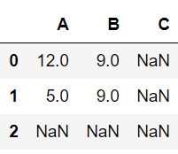


### 统计分析

#### 数据各个种类统计

* 这里我们介绍两种方法，一种是使用 ndarray 进行统计的方法，需要用到之前的 Counter 函数；第二种方法是直接采用 DataFrame 中的函数进行计算。

* 方法1：运用计数器 Counter 统计数据

```python
x = np.random.randint(3, size=20)
x # array([0, 0, 2, 1, 0, 1, 1, 1, 0, 1, 0, 1, 2, 2, 0, 2, 2, 1, 0, 1])
# 可以用 np.unique(x) 来查看 x 有哪些元素组成：array([0, 1, 2])
from collections import Counter
Counter(x)
# Counter({0: 7, 2: 5, 1: 8})
```

* 方法2：运用 **df.value_counts()** 统计数据

```python
x1 = pd.DataFrame(x, columns = ['A'])
x1['A'].value_counts()
"""
1    8
0    7
2    5
Name: A, dtype: int64
"""
```

#### 按列排序

* 本节我们继续使用一开始的例子，并增加一个 "per_GDP" 列：

```python
population_dict = {"BeiJing": 2154,
                   "ShangHai": 2424,
                   "ShenZhen": 1303,
                   "HangZhou": 981 }
population = pd.Series(population_dict) 

GDP_dict = {"BeiJing": 30320,
            "ShangHai": 32680,
            "ShenZhen": 24222,
            "HangZhou": 13468 }
GDP = pd.Series(GDP_dict)

city_info = pd.DataFrame({"population": population,"GDP": GDP})
city_info["per_GDP"] = city_info["GDP"]/city_info["population"]
city_info
```


* **df.sort_values(by, ascending)** 可以实现按照某个列进行排序：
  * by：提供按照哪个列进行排序；
  * ascending：提供使用升序或降序，默认升序。

```python
city_info.sort_values(by='per_GDP') # 输出如图1
city_info.sort_values(by='per_GDP', ascending=False) # 输出如图2
```


#### 按索引排序（按轴排序）

* 本节将使用以下的例子：

```python
df = pd.DataFrame(np.random.randint(20, size=(3, 4)), index=[2, 1, 0], columns=list("CBAD"))
df
```


* **df.sort_index(axis, ascending)** 该方法可实现按照索引（或列名）排序
  * axis：按照哪个轴进行排序；
  * ascending：提供使用升序或降序，默认升序。

```python
df.sort_index() # 按行索引进行升序排序，输出如下图1
df.sort_index(axis=1) # 按列标签进行升序排序，输出如下图2
df.sort_index(axis=1, ascending=False) # 按列标签进行降序排序，输出如下图3
```


#### 常见统计量计算

* 本节以及后面的多节将使用以下的例子：

```python
df = pd.DataFrame(np.random.normal(2, 4, size=(6, 4)),columns=list("ABCD"))
df
```


* 注意：多数方法都可以用 axis 来更换行列。

* **df.count()** 求非空个数
* **df.sum()** 求和
* **df.min()** 最小值 **df.idmin()** 最小值索引位置
* **df.max()** 最大值 **df.idmax()** 最大值索引位置

```python
df.count()
"""
A    6
B    6
C    6
D    6
dtype: int64
"""
```

```python
df.sum()
"""
A     9.582697
B    28.781952
C     9.480388
D    23.085391
dtype: float64
"""
df.sum(axis=1)
"""
0    22.891925
1    17.807988
2    -0.580801
3    -2.710142
4    17.921577
5    15.599881
dtype: float64
"""
```

```python
df.min()
"""
A   -4.039829
B    0.898796
C   -4.252267
D   -1.182524
dtype: float64
"""
df.max(axis=1)
"""
0    12.624040
1     8.567084
2     4.886010
3     1.825853
4     5.722338
5     6.659075
dtype: float64
"""
df.idxmax()
"""
A    4
B    1
C    0
D    0
dtype: int64
"""
```

* **df.mean()** 均值
* **df.var()** 方差
* **df.std()** 标准差
* **df.median()** 中位数
* **df.mode()** 众数
* **df.quantile()** 分位数

```python
df.mean()
"""
A    1.597116
B    4.796992
C    1.580065
D    3.847565
dtype: float64
"""
```

```python
df.var()
"""
A    14.137660
B     7.322950
C    14.188574
D    25.808212
dtype: float64
"""
```

```python
df.std()
"""
A    3.760008
B    2.706095
C    3.766772
D    5.080178
dtype: float64
"""
```

```python
df.median()
"""
A    2.439898
B    4.798540
C    2.585222
D    2.519051
dtype: float64
"""
```

```python
data = pd.DataFrame(np.random.randint(5, size=(10, 2)), columns=list("AB"))
data # 输出如下图1
data.mode() # 输出如下图2
```


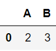

```python
df.quantile(0.75)
"""
A    4.250340
B    6.287380
C    4.556137
D    5.667908
Name: 0.75, dtype: float64
"""
```

#### 描述所有统计量

* **df.describe()** 描述所有统计量：
  * 对于数字类型的 DataFrame，包括数量、平均数、标准差、最小值、25%、50%、75%分位数、最大最小值。
  * 对于字符串类型的 DataFrame，包括数量、统计种类、最频繁的数和频率。

```python
df
df.describe() # 输出如下图1
df_2 = pd.DataFrame([["a", "a", "c", "d"],
                       ["c", "a", "c", "b"],
                       ["a", "a", "d", "c"]], columns=list("ABCD"))
df_2 # 输出如下图2
df_2.describe() # 输出如下图3
```


#### 相关性系数和协方差

* **df.corr()** 返回相关系数组成的 DataFrame
* **df.corrwith()** 返回协方差

```python
df.corr() # 输出如下图
df.corrwith(df['A'])
"""
A    1.000000
B    0.831063
C    0.331060
D    0.510821
dtype: float64
"""
```


#### 自定义输出

* **df.apply(method)** 使用method方法实现自定义输出，默认对每一列进行相应的操作。

* 下面用一些例子来说明：

```python
df # 原DataFrame，输出如下图
```


```python
df.apply(np.cumsum) # 输出如下图1
# 该句可以写成：df.cumsum()
df.apply(np.cumsum, axis=1) # 输出如下图2
# 该句可以写成：df.cumsum(axis=1)
```


```python
df.apply(sum)
# 该句可以写成：df.sum()
"""
A     9.582697
B    28.781952
C     9.480388
D    23.085391
dtype: float64
"""
```

```python
df.apply(lambda x: x.max()-x.min())
"""
A     9.762167
B     7.668288
C     9.394396
D    13.806564
dtype: float64
"""
```

```python
def my_describe(x):
    return pd.Series([x.count(), x.mean(), x.max(), x.idxmin(), x.std()], \
                     index=["Count", "mean", "max", "idxmin", "std"])
df.apply(my_describe)
```


## 缺失值处理

### 检测

* **df.isnull()**
* **df.notnull()**
* 上述两个方法都会返回一个布尔类型的 DataFrame，isnull 函数对空值为 True，notnull 函数对非空值为 True。
* 注意，None 也是空值。当 DataFrame 有 None 值时，数据类型**全部**会修改为 object。NaN 是一种特殊的**浮点数**。
* 小例子：

```python
df = pd.DataFrame(np.array([[1, np.nan, 2],
                              [np.nan, 3, 4],
                              [5, 6, None]]), columns=["A", "B", "C"])
df
```

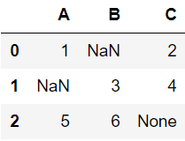

```python
df.isnull() # 输出如图1
df.notnull() # 输出如图2
```

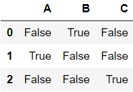

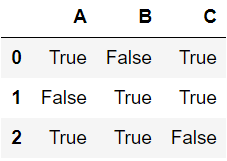


### 删除

* 本节基于以下的例子：

```python
df = pd.DataFrame(np.array([[1, np.nan, 2, 3],
                              [np.nan, 4, 5, 6],
                              [7, 8, np.nan, 9],
                              [10, 11 , 12, 13]]), columns=["A", "B", "C", "D"])
df
```

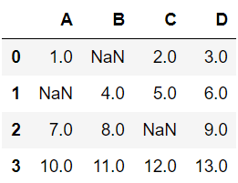

* df.dropna( axis, how ) 行列删除语句
  * axis：设定删除轴。默认为行。axis=1 (或 axis="columns" )时删除列。
  * how：指定删除方式。how="any" 时只要有空值就删除，how="all" 时只删除全部为空值的行（列）。默认为 any。
* 例1：

```python
df.dropna() # 删除有空值的行 输出如图1
df.dropna(axis="columns") # 删除有空值的列 也可以写成axis=1 输出如图2
```

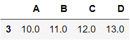

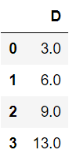

* 例2：

```python
df["D"] = np.nan
df # 输出如图1
df.dropna(axis="columns", how="all") # 输出如图2
df.dropna(axis="columns", how="any") # 输出如图3
```

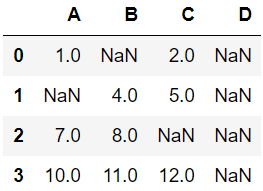

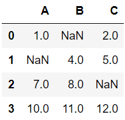

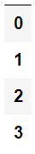


### 填充

* **df.fillna(value)** 该方法对缺失值进行填充。
* 不仅可以只填充一个量，也可以按照自定的值进行填充。用下面的例子加以解释：

```python
df = pd.DataFrame(np.array([[1, np.nan, 2, 3],
                              [np.nan, 4, 5, 6],
                              [7, 8, np.nan, 9],
                              [10, 11 , 12, 13]]), columns=["A", "B", "C", "D"])
df
```

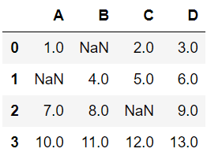

#### 固定值填充

```python
df.fillna(value=5) # 输出如下图
```

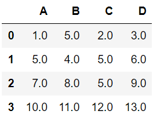

#### 均值填充

```python
fill = df.mean()
fill
"""
A    6.000000
B    7.666667
C    6.333333
D    7.750000
dtype: float64
"""
df.fillna(value=fill) # 输出如下图
```

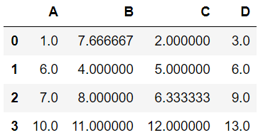

#### 全局均值填充

```python
fill = df.stack().mean()
fill # 7.0
df.fillna(value=fill) # 输出如下图
```

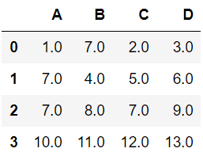


## 合并数据

* 为了更好地表示 DataFrame 的形态，本节采用以下的函数构造 DataFrame：

```python
def make_df(cols, ind):
    "一个简单的DataFrame"
    data = {c: [str(c)+str(i) for i in ind]  for c in cols}
    return pd.DataFrame(data, ind)

make_df("ABC", range(3)) # 输出如下图
```

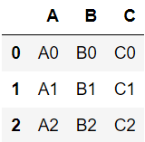

### 垂直合并与水平合并

* **pd.concat([a, b, ...], axis, ignore_index)** 该函数用于对数据进行合并。注意这是一个**函数**而不是方法。
  * axis：设定合并轴，即按水平合并或垂直合并。
  * ignore_index：设定是否忽略索引。

#### 垂直合并

```python
df_1 = make_df("AB", [1, 2])
df_2 = make_df("AB", [3, 4])
df_1 # 输出如下图1
df_2 # 输出如下图2
pd.concat([df_1, df_2]) # 输出如下图3
```

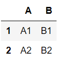

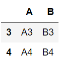


#### 水平合并

```python
df_1 = make_df("AB", [0, 1])
df_2 = make_df("CD", [0, 1])
df_1 # 输出如下图1
df_2 # 输出如下图2
pd.concat([df_1, df_2], axis=1) # 输出如下图3
```

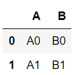

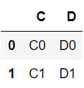

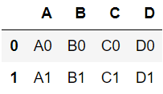

#### 索引重叠的问题

* 两个数据框在合并的时候经常会产生索引重叠的问题。此时需要调用 ignore_index 来重设索引。
* 垂直合并的例子（行重叠）：

```python
df_1 = make_df("AB", [1, 2])
df_2 = make_df("AB", [1, 2])
pd.concat([df_5, df_6]) # 输出如下图1
pd.concat([df_5, df_6], ignore_index=True) # 输出如下图2
```

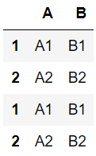

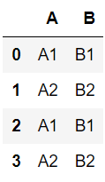

* 水平合并的例子（列重叠）：

```python
df_1 = make_df("ABC", [1, 2])
df_2 = make_df("BCD", [1, 2])
pd.concat([df_1, df_2], axis=1) # 输出如下图1
pd.concat([df_1, df_2], axis=1, ignore_index=True) # 输出如下图2
```

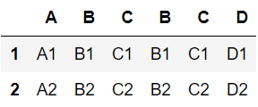

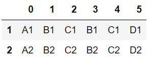


### 对齐合并

#### 合并原理

* **pd.merge(a, b)** 将两个 DataFrame 根据相同列相同元素进行匹配合并。

```python
df_1 = make_df("AB", [1, 2])
df_2 = make_df("BC", [1, 2])
df_1 # 如下图1
df_2 # 如下图2
pd.merge(df_1, df_2) # 如下图3
```

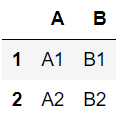

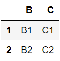

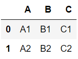

* 上例有相同的 B 列，根据 B 列的 B1 和 B2 元素进行匹配来合并 A 列和 C 列。

```python
df_1 = make_df("AB", [1, 2])
df_2 = make_df("CB", [2, 1])
df_1 # 如下图1
df_2 # 如下图2
pd.merge(df_1, df_2) # 如下图3
```

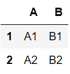

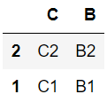


* 上例有相同的 B 列，虽然 B 列的元素顺序不同，但依然可以实现合并。

#### 例：城市合并信息

* 城市人口信息：

```python
population_dict = {"city": ("BeiJing", "HangZhou", "ShenZhen"),
                   "pop": (2154, 981, 1303)}
population = pd.DataFrame(population_dict)
population
```

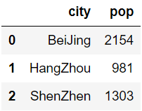

* 城市GDP信息：

```python
GDP_dict = {"city": ("BeiJing", "ShangHai", "HangZhou"),
            "GDP": (30320, 32680, 13468)}
GDP = pd.DataFrame(GDP_dict)
GDP
```

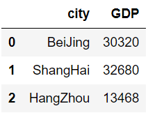

* 模式一：交集合并
  * 只将 city 列中的匹配信息进行输出。

```python
city_info = pd.merge(population, GDP)
city_info
```

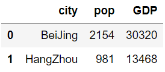

* 模式二：并集合并
  * 将两个 city 列中的所有城市信息进行输出，若有数据不存在则设为 NaN。

```python
city_info = pd.merge(population, GDP, how="outer")
city_info
```

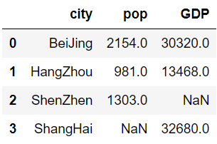


## 分组和数据透视表

* 本节将基于以下例子：

```python
df = pd.DataFrame({"key":["A", "B", "C", "C", "B", "A"],
                  "data1": range(6),
                  "data2": np.random.randint(0, 10, size=6)})
df
```

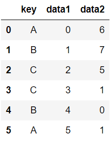

### 分组

* **df.groupby("key")** 对 DataFrame 以 key 键进行分组，形成一个分组（GroupBy）对象。
* 需要注意的是，groupby 函数得到的分组并不是已经分好的内容，而是一个用于延迟计算的对象，有点类似于。

```python
df.groupby("key")
# <pandas.core.groupby.groupby.DataFrameGroupBy object at 0x000002446CAD1470>
```

#### 打印分组

* 分组对象是一个可迭代对象，因此可以遍历：

```python
for i in df.groupby("key"):
    print(str(i))
"""
('A',   key  data1  data2
0   A      0      6
5   A      5      1)
('B',   key  data1  data2
1   B      1      7
4   B      4      0)
('C',   key  data1  data2
2   C      2      5
3   C      3      1)
"""
```

#### 基本分组处理

* 直接对分组对象进行求和、求均值操作：

```python
df.groupby("key").sum() # 输出如下图1
df.groupby("key").mean() # 输出如下图2
```

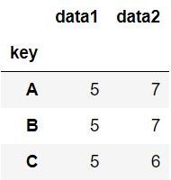

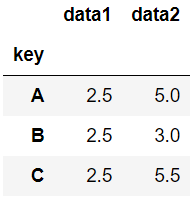

#### 键的设定

* 列表、数组也可以设定为分组键。下面举一个列表的例子说明：

```python
L = [0, 1, 0, 1, 2, 0]
df.groupby(L).sum() # 根据L设定分组
```

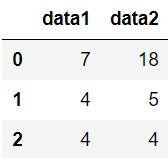

* 字典映射
  * 可以通过索引将字典映射到不同的分组。举例说明：

```python
df2 = df.set_index("key")
df2
```

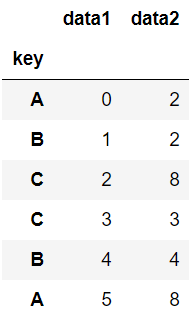

```python
mapping = {"A": "first", "B": "constant", "C": "constant"} # 将A组映射为first，B、C组映射为constant
df2.groupby(mapping).sum()
```


* 用 Python 函数也可以建立映射：

```python
df2.groupby(str.lower).mean() # 通过lower函数将大写字母映射成小写字母
```

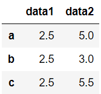

* 设定多个有效值组成的列表：

```python
df2.groupby([str.lower, mapping]).mean()
```

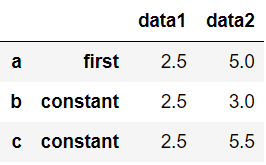

#### 按列取值

* 可以选一列数据进行处理：

```python
df.groupby("key")["data2"].sum()
"""
key
A    7
B    7
C    6
Name: data2, dtype: int32
"""
```

#### 按组迭代

* 可以根据分组一组一组进行处理：

```python
for data, group in df.groupby("key"):
    print(data, group) # data是组名，group是每个组的DataFrame
    print("shape={0}".format(group.shape))
"""
A   key  data1  data2
0   A      0      6
5   A      5      1
shape=(2, 3)
B   key  data1  data2
1   B      1      7
4   B      4      0
shape=(2, 3)
C   key  data1  data2
2   C      2      5
3   C      3      1
shape=(2, 3)
"""
```

#### 调用方法

* 调用 describe() 方法产生分组描述：

```python
df.groupby("key")["data1"].describe()
```

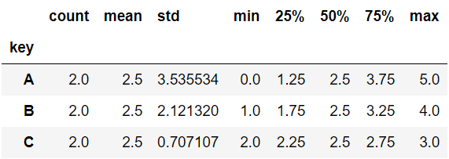

* 调用 aggregate() 方法产生每组每列的描述：

```python
df.groupby("key").aggregate(["min", "median", "max"])
```

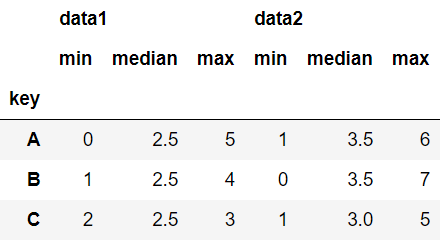

#### 过滤

* **df.groupby().filter(func)** 根据某个标准可以对不符合标准的组别进行过滤。
* 下例展示了如何根据标准差进行过滤：

```python
def filter_func(x):
    return x["data2"].std() > 3
df.groupby("key")["data2"].std()
"""
key
A    3.535534
B    4.949747
C    2.828427
Name: data2, dtype: float64
"""
df.groupby("key").filter(filter_func)
```

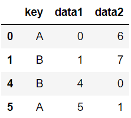

#### 转换（自定义方法）

* **df.groupby().transform(func)**
* **df.groupby().apply(func)**
* 上述两个方法对 DataFrame 的内容进行计算，apply() 可以实现对某个具体函数的变换，应用范围更广。

```python
df.groupby("key").transform(lambda x: x-x.mean())
df.groupby("key").apply(lambda x: x-x.mean()) # 两个方法的输出结果一样，如下图
```

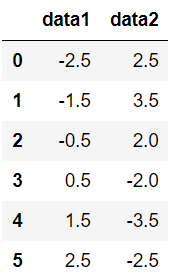

* apply 方法的另一个例子：

```python
def norm_by_data2(x):
    x["data1"] /= x["data2"].sum()
    return x
df.groupby("key").apply(norm_by_data2) # 这一方法用transform就不行
```


### 例：行星观测数据处理

* 本节用行星观测数据处理的例子来展示分组数据分析的技巧。

```python
import seaborn as sns
planets = sns.load_dataset("planets", engine="python") # 加入引擎否则有可能会报OSError错误
```

#### 基本描述

* 查看形状：

```python
planets.shape # (1035, 6)
```

* 查看前几行：

```python
planets.head()
```

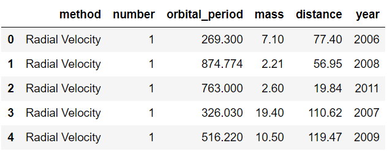

* 可以看出，该数据集包括行星发现的年份、质量、距离等信息。
* 查看数据集的描述：

```python
planets.describe()
```

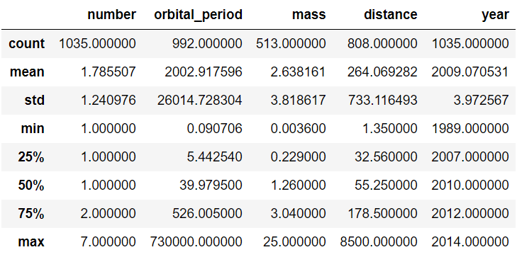

#### 任务

* 现在我们希望描述不同decade、不同方法（method）产生的行星情况。
* 首先，将年份信息改成10年为一界限。

```python
decade = 10 * (planets["year"] // 10)
decade.head()
"""
0    2000
1    2000
2    2010
3    2000
4    2000
Name: year, dtype: int64
"""
decade = decade.astype(str) + 's' # 年份信息转成字符串，并+s
decade.name = "decade"
decade.head()
"""
0    2000s
1    2000s
2    2010s
3    2000s
4    2000s
Name: decade, dtype: object
"""
```

* 根据 method、decade 进行分组：

```python
planets.groupby(["method", decade]).sum()
```

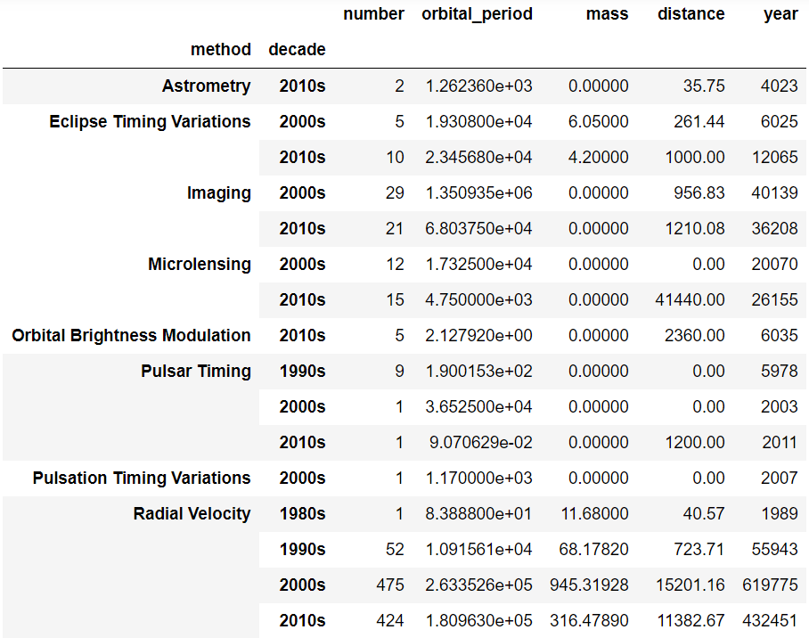

* 现在我们单独把 number 拿出来，根据不同的 method、不同的 decade 来形成一个分组表。
  * 下面的语句我们单独讲解一下：
    * **[["number"]]** 这里使用两个中括号的意义是生成一个 DataFrame，否则会生成一个 Series。
    * **.sum()** 提供了求和信息。
    * **.unstack()** 是展开的意思，即将 method 和 decade 分别作为行和列展开成一个表。
    * **.fillna(0)** 填充缺失值为0。

```python
planets.groupby(["method", decade])[["number"]].sum().unstack().fillna(0)
```


### 数据透视表

* **df.pivot_table("columns", index, columns, aggfunc, margins)** 使用数据透视表
* 数据透视表的例子我们放在泰坦尼克号的数据处理中介绍。


### 例：泰坦尼克号乘客数据分析

#### 准备

* 首先导入数据：

```python
import seaborn as sns

titanic = sns.load_dataset("titanic", engine="python")
```

* 查看前几行：

```python
titanic.head()
```

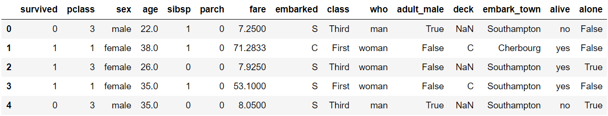

* 查看描述：

```python
titanic.describe()
```

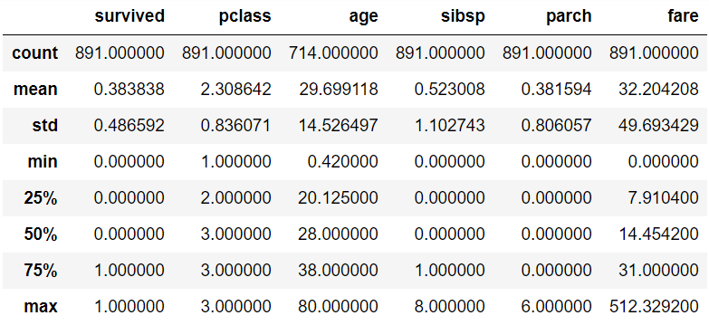

#### 统计

* 对男女存活比例的统计：

```python
titanic.groupby("sex")[["survived"]].mean()
```


* 分舱位进一步详细统计：

```python
titanic.groupby(["sex", "class"])["survived"].aggregate("mean").unstack()
```


#### 数据透视表的使用

* 上述统计方法可以直接使用数据透视表来生成：

```python
titanic.pivot_table("survived", index="sex", columns="class") # 默认aggfunc="mean"，可写可不写
```


* 如果需要展示总计结果，需要添加 margins 参数：

```python
titanic.pivot_table("survived", index="sex", columns="class", aggfunc="mean", margins=True)
```


* 从 fare 和 survived 两个角度统计：

```python
titanic.pivot_table(index="sex", columns="class", aggfunc={"survived": "sum", "fare": "mean"})
```


## 其他内容

### 多级索引：多维数据

* 我们直接展示一个多级索引的例子：

```python
base_data = np.array([[1771, 11115 ],
                      [2154, 30320],
                      [2141, 14070],
                      [2424, 32680],
                      [1077, 7806],
                      [1303, 24222],
                      [798, 4789],
                      [981, 13468]]) 
data = pd.DataFrame(base_data, index=[["BeiJing","BeiJing","ShangHai","ShangHai","ShenZhen","ShenZhen","HangZhou","HangZhou"]\
                                     , [2008, 2018]*4], columns=["population", "GDP"])
data
```


* 其实多级索引仅仅需要将索引转化为二维数组（列表）即可。
* 添加索引名：

```python
data.index.names = ["city", "year"]
data
```


* 单取出 GDP：

```python
data[["GDP"]]
```


* 数据标量索引：

```python
data.loc["ShangHai", "GDP"]
"""
year
2008    14070
2018    32680
Name: GDP, dtype: int32
"""
data.loc["ShangHai", 2018]["GDP"] # 32680
```


### 高性能 Pandas

* Pandas 还提供了一些高性能运算函数，这里计算其中的两个：
* 高性能函数存在的目的是当使用非常大的 DataFrame 进行运算时，该方法的计算效率更高，速度更快。
  * 但是如果 DataFrame 的规模较小，可能结果并不如直接计算来的方便。

#### eval()

* **pd.eval(str)** 该函数需要填入一个复合代数式的字符串形式。该函数的意义是计算该代数式并返回结果。
* 方法1：直接计算

```python
df1, df2, df3, df4 = (pd.DataFrame(np.random.random((10000,100))) for i in range(4))
# 方法1：
res = (df1 + df2) / (df3 + df4)
res.head() # 输出如下图
%timeit (df1 + df2) / (df3 + df4)
# 13.9 ms ± 1.5 ms per loop (mean ± std. dev. of 7 runs, 100 loops each)
```


* 方法2：eval() 函数

```python
res = pd.eval("(df1 + df2) / (df3 + df4)")
res.head() # 输出如下图
%timeit pd.eval("(df1 + df2) / (df3 + df4)")
# 9.82 ms ± 1e+03 µs per loop (mean ± std. dev. of 7 runs, 100 loops each)
```


* 检验两者是否相同：

```python
np.allclose((df1 + df2) / (df3 + df4), pd.eval("(df1 + df2) / (df3 + df4)"))
# True
```

#### query()

* **df.query(str)** 该方法需要填入一个数据筛选式。
* 方法1：直接筛选

```python
df = pd.DataFrame(np.random.random((1000, 3)), columns=list("ABC"))
# 方法1：
res = df[(df.A < 0.5) & (df.B > 0.5)]
res.head() # 输出如下图
%timeit df[(df.A < 0.5) & (df.B > 0.5)]
# 893 µs ± 81 µs per loop (mean ± std. dev. of 7 runs, 1000 loops each)
```


* 方法2：query() 函数

```python
res = df.query("(A < 0.5) & (B > 0.5)")
res.head() # 输出如下图
%timeit df.query("(A < 0.5) & (B > 0.5)")
# 2.08 ms ± 194 µs per loop (mean ± std. dev. of 7 runs, 1000 loops each)
```


* 检验两者是否相同：

```python
np.allclose(df[(df.A < 0.5) & (df.B > 0.5)], df.query("(A < 0.5) & (B > 0.5)"))
# True
```

#### 调用时机

* 从上述两个方法使用来说，可以看出：
  * 小数组时，普通方法反而更快。
  * 大数组时，应考虑使用高性能方法。


* 其他内容请自行查阅帮助文档。
* Written by：Sirius. Lu
* Reference：深度之眼  python基础训练营
* 2020.7.8