# Python 学习笔记（六）数据可视化

* 本笔记 # 后为该语句的输出结果，或该变量的值。若 # 后接 ! 号，意思是该语句不能这样写。
* 对于多行的输出结果，我会用""" """进行注释。
* 对于一些输出结果，笔记中为方便理解会在一个代码块写出所有的输出语句，实际调试中应该仅保留一个输出语句（格式化输出print除外），否则前面的输出会被最后一个输出语句覆盖。


* 本笔记的内容主要基于深度之眼的Python基础训练营课程，在顺序和例子上面进行了一些修改和总结。
* 本文对Python的基本语法特性将不做详细回顾，因此对于Python的基本语法的请参看笔记（一）基础编程和笔记（二）高级编程。
* 本笔记主要介绍Python的 Matplotlib 库，并对其他绘图工具做一介绍。


## 环境配置

* matplotlib 在使用前需要进行一些小配置，在这里事先说明。

### 导入模块

* 与其他模块不同，我们主要使用的是 matplotlib 的 pyplot 模块，因此只要导入这个模块即可：
  * 我们习惯性地将该模块简写为 plt。

```python
import matplotlib.pyplot as plt
```

* 需要注意的是，我们常常输出内容会搭配 numpy 库使用，所以需要导入 numpy 库。


### 手动输出

* **plt.show()** 输出当前绘制的图形
* 我们希望在执行绘图语句后直接输出。在这一点上，不同的解释器的效果不同。

#### pycharm

* pycharm 必须使用 **plt.show()** 语句进行输出。

#### jupyter notebook

* jupyter notebook 中有一个魔术方法：

```python
%matplotlib inline
```

* 添加该语句后，输出图形不需要使用 plt.show() 即可预览结果。
* 因此有的书籍中不显式地写出 plt.show() 语句，是因为可以直接输出结果。


### 例：基本折线输出

* **plt.plot(x, y)** 该函数可根据 x、y 坐标顺序连成折线输出。
* **plt.xlabel("label")** 该函数需要给出一个字符串，对 x 轴设置标签。
* **plt.ylabel("label")** 该函数需要给出一个字符串，对 y 轴设置标签。

```python
x = [1, 2, 3, 4]
y = [1, 4, 9, 16]
plt.plot(x, y) # 输出如下图
plt.xlabel("x value")
plt.ylabel("squares")
# plt.show()
```

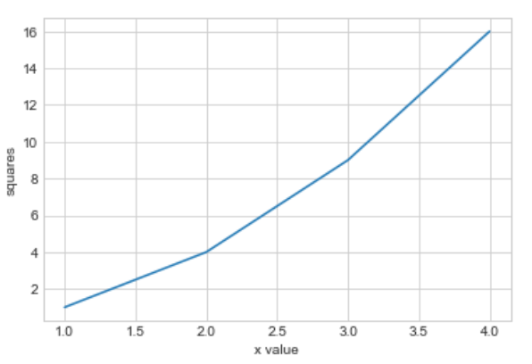


### 样式设置

* 图片可以有多种样式可供选择：
* **plt.style.available** 返回 plt 的所有样式清单，是一个list。
* **plt.style.use("stylename")** 设置全局输出样式。一般在设置后所有输出都会按照这个样式输出。
* **plt.style.context("stylename")** 设置当前图的背景样式。一般搭配 **with** 块使用。

```python
plt.style.available[:5]
"""
['bmh', 'classic', 'dark_background', 'fast', 'fivethirtyeight']
"""
plt.style.use("seaborn-whitegrid") # 设置样式
with plt.style.context("ggplot"):
    plt.plot(x, y) # 输出如下图
```

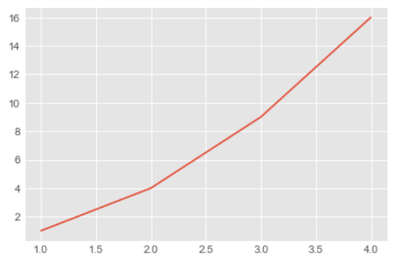


### 存储图像

* **plt.savefig("figname")** 存储图片为某个名字。需要添加后缀名（如.png）

```python
import numpy as np
x = np.linspace(0, 10, 100) # 从0~10取100个点
plt.plot(x, np.exp(x))
plt.savefig("my_picture.png") # 保存文件。默认目录为该代码文件的目录。也可以自由设置目录。
```

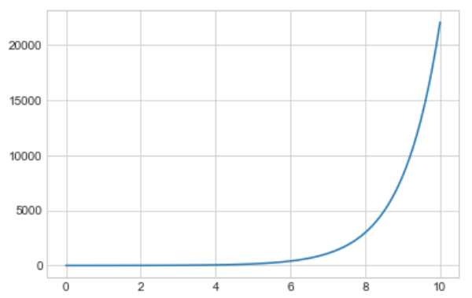


### 总结

* 总结一下，在打印图片之前，需要做如下配置：

```python
%matplotlib inline
import matplotlib.pyplot as plt
plt.style.use("seaborn-whitegrid")
import numpy as np
```

* 后文就不详细说明了。


## 折线图

* 本节介绍的折线图也包括曲线，因为当折线图的点分布密集时，可以看成是一条曲线。因此不做区分。

### 基本折线图的绘制

* **plt.plot()** 绘制折线图
* 下例绘制了一个 sin 函数：

```python
x = np.linspace(0, 2*np.pi, 100) # 从0~2pi，取100个点
plt.plot(x, np.sin(x)) # 输出如下图
```

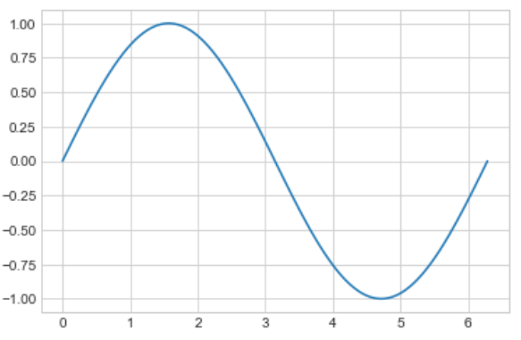

#### 多条曲线

* 通过多次调用 plot() 函数来输出多条曲线：(在一个 cell 中)

```python
x = np.linspace(0, 2*np.pi, 100)
plt.plot(x, np.cos(x))
plt.plot(x, np.sin(x))
```

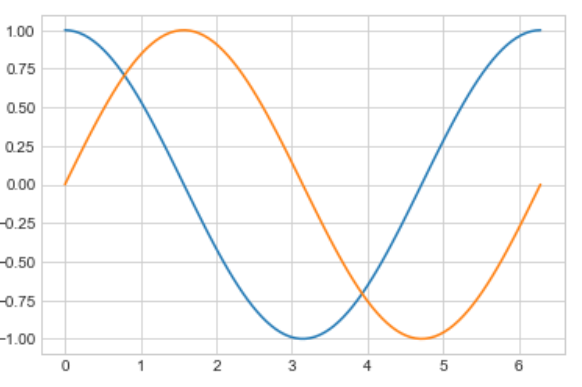


### 线条调整

#### 颜色调整

* plt.plot() 函数增设 **color** 参数（该参数可简写为 c），可实现线条颜色的自由调整。
  * 请注意，颜色选项中如果该字母不会产生歧义，可以进行简写：
    * 如 'green' 简写为 'g'，'red' 简写为 'r'，'yellow' 简写为 'y'。

```python
offsets = np.linspace(0, np,pi, 5) # 从0~pi取5条不同的曲线位置
colors = ['blue', 'g', 'r', 'yellow', 'pink'] # 颜色分别为蓝(blue)、绿(green)、红(red)、黄(yellow)、粉(pink)
for offset, color in zip(offsets, colors):
    plt.plot(x, np.sin(x-offset), color=color)
```

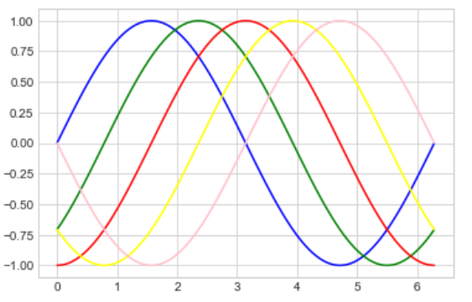

#### 线型调整

* plt.plot() 函数增设 **linestyle** 参数（该参数可简写为 ls），可实现线型调整。默认线条都为实线。
  * 下面展示了几种常见的线型，而且可以根据实际形状进行简写：
    * 'solid' 或 '-' ：实线；
    * 'dashed' 或 '--' ：虚线；
    * 'dashdot' 或 '-.' ：点画线；
    * 'dotted' 或 ':' ：点线。

```python
x = np.linspace(0, 10, 11)
offsets = list(range(8))
linestyles = ["solid", "dashed", "dashdot", "dotted", "-", "--", "-.", ":"]
for offset, linestyle in zip(offsets, linestyles):
    plt.plot(x, x+offset, linestyle=linestyle) # linestyle可简写为ls
```

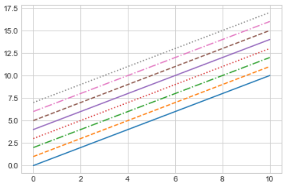

#### 线宽调整

* plt.plot() 函数增设 **linewidth** 参数（该参数可简写为 lw），可实现线宽调整。线宽为一浮点数值，默认线宽为1。

```python
x = np.linspace(0, 10, 11)
offsets = list(range(0, 12, 3))
linewidths = (i*2 for i in range(1,5)) # 线宽分别为2,4,6,8,10
for offset, linewidth in zip(offsets, linewidths):
    plt.plot(x, x+offset, linewidth=linewidth) # linewidth可简写为lw
```

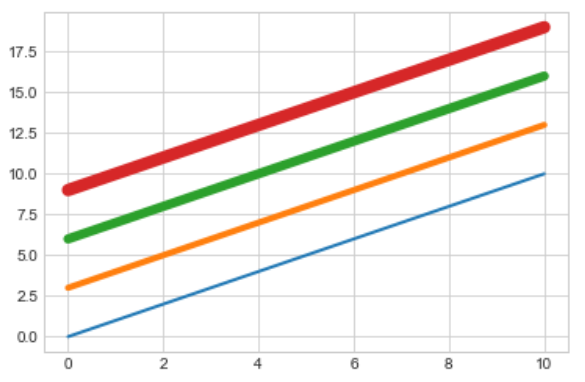


### 数据点标记

#### 添加标记

* plt.plot() 函数增设 **marker** 参数，可增加数据点标记。默认无标记。
  * 下面展示了几种常见的标记方式：
    * '*' ：五角星标记；
    * '+' ：加号标记；
    * 'o' ：圆形标记；
    * 's' ：正方形标记。

```python
x = np.linspace(0, 10, 11)
offsets = list(range(0, 12, 3))
markers = ["*", "+", "o", "s"] # 4种标记
for offset, marker in zip(offsets, markers):
    plt.plot(x, x+offset, marker=marker)
```

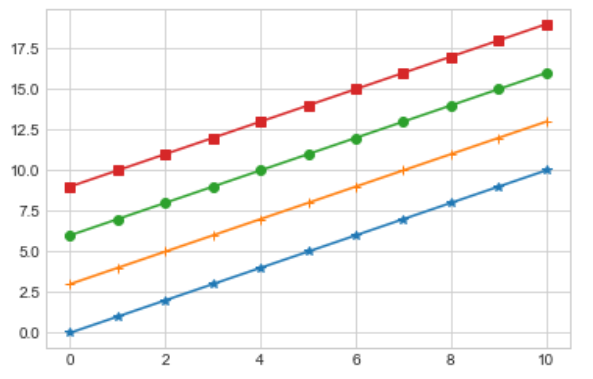

#### 标记大小

* plt.plot() 函数增设 **markersize** 参数（该参数可简写为 ms），可实现标记大小的调整。该参数为一个浮点型数据。

```python
x = np.linspace(0, 10, 11)
offsets = list(range(0, 12, 3))
markers = ["*", "+", "o", "s"]
for offset, marker in zip(offsets, markers):
    plt.plot(x, x+offset, marker=marker, markersize=7) # markersize可简写为ms
```

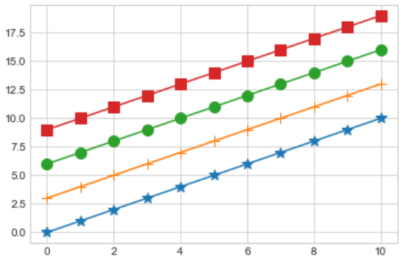

#### 线条整体风格设置

* plt.plot() 函数可通过设计第三个位置参数的方法进行快速的风格设置。
  * 方法一：颜色+线型。下为示例：
    * 'g-'：绿色实线；
    * 'b--'：蓝色虚线；
    * 'k-.'：黑色点画线；
    * 'r:'：红色点线。
  * 方法二：颜色+标记+线型。下为示例：
    * 'g*-'：绿色+五角星标记+实线；
    * 'b+--'：蓝色+加号标记+虚线；
    * 'ko-.'：黑色+圆形标记+点画线；
    * 'rs:'：红色+正方形标记+点线。

```python
# 方法一
x = np.linspace(0, 10, 11)
offsets = list(range(0, 8, 2))
color_linestyles = ["g-", "b--", "k-.", "r:"]
for offset, color_linestyle in zip(offsets, color_linestyles):
    plt.plot(x, x+offset, color_linestyle)
```

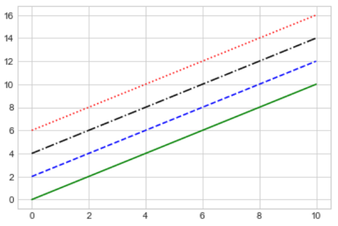

```python
# 方法二
x = np.linspace(0, 10, 11)
offsets = list(range(0, 8, 2))
color_marker_linestyles = ["g*-", "b+--", "ko-.", "rs:"]
for offset, color_marker_linestyle in zip(offsets, color_marker_linestyles):
    plt.plot(x, x+offset, color_marker_linestyle)
```

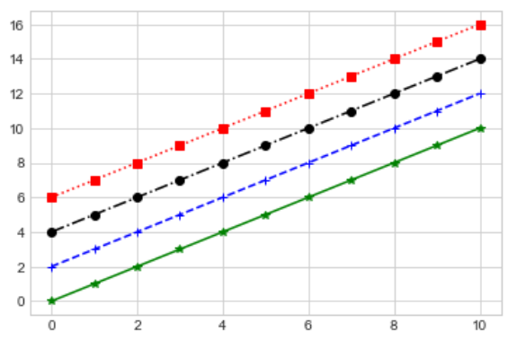

#### 参考手册

更多风格请查阅参考手册：

https://matplotlib.org/api/_as_gen/matplotlib.pyplot.plot.html#matplotlib.pyplot.plot


### 调整坐标轴

#### 坐标轴范围

* **plt.xlim(left, right)** 该函数用于调整输出x坐标轴的范围。
* **plt.ylim(low, high)** 该函数用于调整输出y坐标轴的范围。

```python
x = np.linspace(0, 2*np.pi, 100)
plt.plot(x, np.sin(x))
plt.xlim(-1, 7)
plt.ylim(-1.5, 1.5)
```

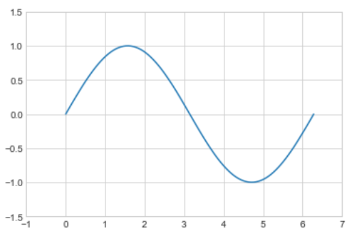

#### 坐标轴综合调整

* **plt.axis()** 该函数用于综合调整x、y坐标轴。
  * 方法1：**plt.axis([x1, x2, y1, y2])** 直接根据参数调整 x、y 轴范围。这一方法与直接使用xlim和ylim函数的效果一致。
  * 方法2：**plt.axis("stylename")** 根据风格名称，由系统自动调整。

```python
x = np.linspace(0, 2*np.pi, 100)
plt.plot(x, np.sin(x))
plt.axis([-2, 8, -2, 2]) # x轴从-2~8，y轴从-2~2
```

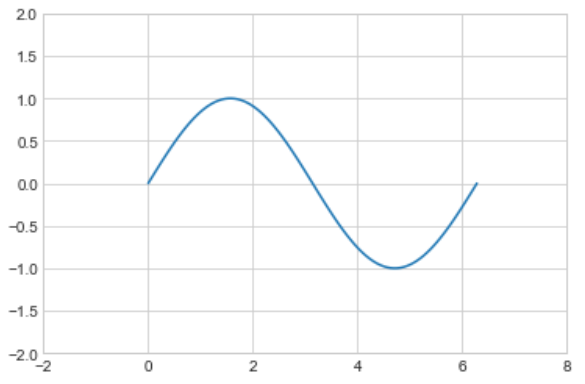

```python
x = np.linspace(0, 2*np.pi, 100)
plt.plot(x, np.sin(x))
plt.axis("tight") # 紧凑风格，曲线最值会直接贴到图像边缘
```

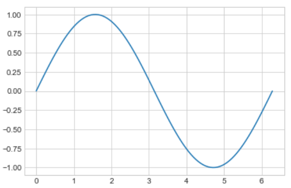

```python
x = np.linspace(0, 2*np.pi, 100)
plt.plot(x, np.sin(x))
plt.axis("equal") # 等距风格，x、y坐标轴是等比例的
```

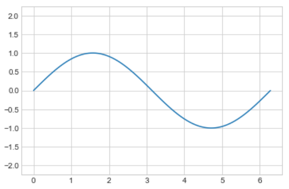

* 通过 **?plt.axis** 语句获得更详细信息。

#### 对数坐标轴

* **plt.xscale("log")** 将x轴维度更换为对数；
* **plt.yscale("log")** 将y轴维度更换为对数。

```python
x = np.logspace(0, 5, 100)
plt.plot(x, np.log(x))
plt.xscale("log")
```

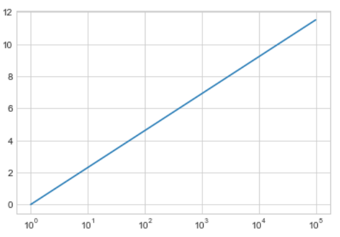

#### 轴标签、标题

* 该内容前面已经介绍过了，这里再提一下：

* **plt.xlabel("label")** 该函数需要给出一个字符串，对 x 轴设置标签。
* **plt.ylabel("label")** 该函数需要给出一个字符串，对 y 轴设置标签。
* **plt.title("title")** 该函数设置标题。

```python
x = np.linspace(0, 2*np.pi, 100)
plt.plot(x, np.sin(x))
plt.title("A Sine Curve", fontsize=20)
plt.xlabel("x", fontsize=15)
plt.ylabel("sin(x)", fontsize=15)
```

[18]


### 调整刻度

#### 调整坐标轴刻度

* **plt.xticks(ticks)** 更改 x 轴刻度
* **plt.yticks(ticks)** 更改 y 轴刻度

```python
x = np.linspace(0, 10, 100)
plt.plot(x, x**2)
plt.xticks(np.arange(0, 12, step=1)) # 从0~11,每格为1
plt.yticks(np.arange(0, 110, step=10)) # 从0~100,每格为10
```

[19]

#### 调整刻度大小

* plt.xticks（或 yticks）增设 **fontsize** 来修改字体大小。

```python
x = np.linspace(0, 10, 100)
plt.plot(x, x**2)
plt.xticks(np.arange(0, 12, step=1), fontsize=15) # 扩大x刻度大小
plt.yticks(np.arange(0, 110, step=10))
```

[20]

#### 刻度样式综合调整

* **plt.tick_params(...)** 该函数可以实现对刻度的综合调整。包括大小等等。具体内容请查阅文档。

```python
x = np.linspace(0, 10, 100)
plt.plot(x, x**2)
plt.tick_params(axis="both", labelsize=15) # 两轴刻度字体大小都修改为15
```

[21]


### 设置图例

#### 基本图例设置

* 在画曲线图的时候（plt.plot）设置 **label** 参数，来标识每个图例的名称。
* **plt.legend()** 显示图例

```python
x = np.linspace(0, 2*np.pi, 100)
plt.plot(x, np.sin(x), "b-", label="Sin")
plt.plot(x, np.cos(x), "r--", label="Cos")
plt.legend()
```

[22]

#### 修饰图例

* plt.legend() 增设一些参数来修饰：
  * loc 参数：一个字符串来设置图例的位置。也可以选择 "best" 让系统自动判定哪个位置最好。
  * frameon 参数：设为 True 时，图例会增加一个边框。
  * fontsize 参数：修改图例的字体大小。

```python
x = np.linspace(0, 2*np.pi, 100)
plt.plot(x, np.sin(x), "b-", label="Sin")
plt.plot(x, np.cos(x), "r--", label="Cos")
plt.ylim(-1.5, 2)
plt.legend(loc="upper center", frameon=True, fontsize=15)
```

[23]


### 添加文字说明与箭头

#### 添加文字说明

* **plt.text(x, y, "text", fontsize)** 在坐标 (x, y) 处添加文字 "text"，字体大小为 fontsize。

```python
x = np.linspace(0, 2*np.pi, 100)
plt.plot(x, np.sin(x), "b-")
plt.text(3.5, 0.5, "y=sin(x)", fontsize=15)
```

[24]

#### 添加箭头

* **plt.annotate("text", xy, xytext, arrowprops)** 添加箭头以及说明文本
  * "text"：说明文本；
  * xytext：说明文本的位置；
  * xy：箭头指向；
  * arrowprops：相关箭头参数。
* 具体参数请查阅文档。

```python
x = np.linspace(0, 2*np.pi, 100)
plt.plot(x, np.sin(x), "b-")
plt.annotate('local min', xy=(1.5*np.pi, -1), xytext=(4.5, 0),
             arrowprops=dict(facecolor='black', shrink=0.1),
             )
```

[25]


## 散点图

### 基本散点图的绘制

* **plt.scatter(x, y, marker, s, c)** 散点图绘制函数
  * x, y：x坐标数组、y坐标数组；
  * marker：散点类型；
  * s：散点大小；
  * c：颜色。

```python
x = np.linspace(0, 2*np.pi, 20)
plt.scatter(x, np.sin(x), marker="o", s=30, c="r")    # 圆圈、大小30、红色
```

[26]


### 颜色配置