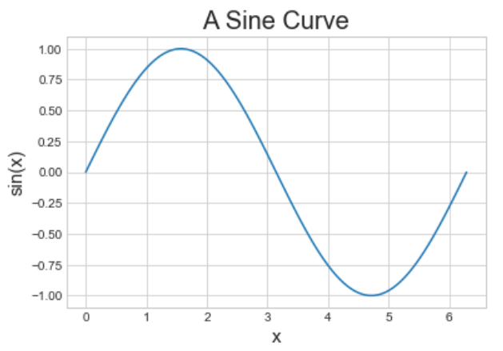
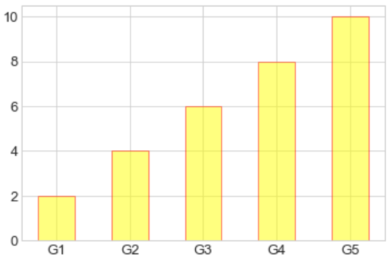
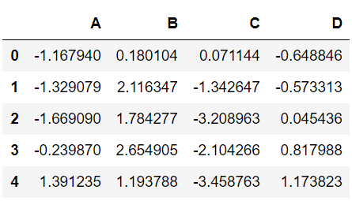

# Python 学习笔记（六）数据可视化

* 本笔记 # 后为该语句的输出结果，或该变量的值。若 # 后接 ! 号，意思是该语句不能这样写。
* 对于多行的输出结果，我会用""" """进行注释。
* 对于一些输出结果，笔记中为方便理解会在一个代码块写出所有的输出语句，实际调试中应该仅保留一个输出语句（格式化输出print除外），否则前面的输出会被最后一个输出语句覆盖。


* 本笔记的内容主要基于深度之眼的Python基础训练营课程，在顺序和例子上面进行了一些修改和总结。
* 本文对Python的基本语法特性将不做详细回顾，因此对于Python的基本语法的请参看笔记（一）基础编程和笔记（二）高级编程。
* 本笔记主要介绍Python的 Matplotlib 库，并对其他绘图工具做一介绍。


## 环境配置

* matplotlib 在使用前需要进行一些小配置，在这里事先说明。

### 导入模块

* 与其他模块不同，我们主要使用的是 matplotlib 的 pyplot 模块，因此只要导入这个模块即可：
  * 我们习惯性地将该模块简写为 plt。

```python
import matplotlib.pyplot as plt
```

* 需要注意的是，我们常常输出内容会搭配 numpy 库使用，所以需要导入 numpy 库。


### 手动输出

* **plt.show()** 输出当前绘制的图形
* 我们希望在执行绘图语句后直接输出。在这一点上，不同的解释器的效果不同。

#### pycharm

* pycharm 必须使用 **plt.show()** 语句进行输出。

#### jupyter notebook

* jupyter notebook 中有一个魔术方法：

```python
%matplotlib inline
```

* 添加该语句后，输出图形不需要使用 plt.show() 即可预览结果。
* 因此有的书籍中不显式地写出 plt.show() 语句，是因为可以直接输出结果。


### 例：基本折线输出

* **plt.plot(x, y)** 该函数可根据 x、y 坐标顺序连成折线输出。
* **plt.xlabel("label")** 该函数需要给出一个字符串，对 x 轴设置标签。
* **plt.ylabel("label")** 该函数需要给出一个字符串，对 y 轴设置标签。

```python
x = [1, 2, 3, 4]
y = [1, 4, 9, 16]
plt.plot(x, y) # 输出如下图
plt.xlabel("x value")
plt.ylabel("squares")
# plt.show()
```


### 样式设置

* 图片可以有多种样式可供选择：
* **plt.style.available** 返回 plt 的所有样式清单，是一个list。
* **plt.style.use("stylename")** 设置全局输出样式。一般在设置后所有输出都会按照这个样式输出。
* **plt.style.context("stylename")** 设置当前图的背景样式。一般搭配 **with** 块使用。

```python
plt.style.available[:5]
"""
['bmh', 'classic', 'dark_background', 'fast', 'fivethirtyeight']
"""
plt.style.use("seaborn-whitegrid") # 设置样式
with plt.style.context("ggplot"):
    plt.plot(x, y) # 输出如下图
```


### 存储图像

* **plt.savefig("figname")** 存储图片为某个名字。需要添加后缀名（如.png）

```python
import numpy as np
x = np.linspace(0, 10, 100) # 从0~10取100个点
plt.plot(x, np.exp(x))
plt.savefig("my_picture.png") # 保存文件。默认目录为该代码文件的目录。也可以自由设置目录。
```


### 总结

* 总结一下，在打印图片之前，需要做如下配置：

```python
%matplotlib inline
import matplotlib.pyplot as plt
plt.style.use("seaborn-whitegrid")
import numpy as np
```

* 后文就不详细说明了。


## 折线图

* 本节介绍的折线图也包括曲线，因为当折线图的点分布密集时，可以看成是一条曲线。因此不做区分。

### 基本折线图的绘制

* **plt.plot()** 绘制折线图
* 下例绘制了一个 sin 函数：

```python
x = np.linspace(0, 2*np.pi, 100) # 从0~2pi，取100个点
plt.plot(x, np.sin(x)) # 输出如下图
```


#### 多条曲线

* 通过多次调用 plot() 函数来输出多条曲线：(在一个 cell 中)

```python
x = np.linspace(0, 2*np.pi, 100)
plt.plot(x, np.cos(x))
plt.plot(x, np.sin(x))
```


### 线条调整

#### 颜色调整

* plt.plot() 函数增设 **color** 参数（该参数可简写为 c），可实现线条颜色的自由调整。
  * 请注意，颜色选项中如果该字母不会产生歧义，可以进行简写：
    * 如 'green' 简写为 'g'，'red' 简写为 'r'，'yellow' 简写为 'y'。

```python
offsets = np.linspace(0, np,pi, 5) # 从0~pi取5条不同的曲线位置
colors = ['blue', 'g', 'r', 'yellow', 'pink'] # 颜色分别为蓝(blue)、绿(green)、红(red)、黄(yellow)、粉(pink)
for offset, color in zip(offsets, colors):
    plt.plot(x, np.sin(x-offset), color=color)
```


#### 线型调整

* plt.plot() 函数增设 **linestyle** 参数（该参数可简写为 ls），可实现线型调整。默认线条都为实线。
  * 下面展示了几种常见的线型，而且可以根据实际形状进行简写：
    * 'solid' 或 '-' ：实线；
    * 'dashed' 或 '--' ：虚线；
    * 'dashdot' 或 '-.' ：点画线；
    * 'dotted' 或 ':' ：点线。

```python
x = np.linspace(0, 10, 11)
offsets = list(range(8))
linestyles = ["solid", "dashed", "dashdot", "dotted", "-", "--", "-.", ":"]
for offset, linestyle in zip(offsets, linestyles):
    plt.plot(x, x+offset, linestyle=linestyle) # linestyle可简写为ls
```


#### 线宽调整

* plt.plot() 函数增设 **linewidth** 参数（该参数可简写为 lw），可实现线宽调整。线宽为一浮点数值，默认线宽为1。

```python
x = np.linspace(0, 10, 11)
offsets = list(range(0, 12, 3))
linewidths = (i*2 for i in range(1,5)) # 线宽分别为2,4,6,8,10
for offset, linewidth in zip(offsets, linewidths):
    plt.plot(x, x+offset, linewidth=linewidth) # linewidth可简写为lw
```


### 数据点标记

#### 添加标记

* plt.plot() 函数增设 **marker** 参数，可增加数据点标记。默认无标记。
  * 下面展示了几种常见的标记方式：
    * '*' ：五角星标记；
    * '+' ：加号标记；
    * 'o' ：圆形标记；
    * 's' ：正方形标记。

```python
x = np.linspace(0, 10, 11)
offsets = list(range(0, 12, 3))
markers = ["*", "+", "o", "s"] # 4种标记
for offset, marker in zip(offsets, markers):
    plt.plot(x, x+offset, marker=marker)
```


#### 标记大小

* plt.plot() 函数增设 **markersize** 参数（该参数可简写为 ms），可实现标记大小的调整。该参数为一个浮点型数据。

```python
x = np.linspace(0, 10, 11)
offsets = list(range(0, 12, 3))
markers = ["*", "+", "o", "s"]
for offset, marker in zip(offsets, markers):
    plt.plot(x, x+offset, marker=marker, markersize=7) # markersize可简写为ms
```


#### 线条整体风格设置

* plt.plot() 函数可通过设计第三个位置参数的方法进行快速的风格设置。
  * 方法一：颜色+线型。下为示例：
    * 'g-'：绿色实线；
    * 'b--'：蓝色虚线；
    * 'k-.'：黑色点画线；
    * 'r:'：红色点线。
  * 方法二：颜色+标记+线型。下为示例：
    * 'g*-'：绿色+五角星标记+实线；
    * 'b+--'：蓝色+加号标记+虚线；
    * 'ko-.'：黑色+圆形标记+点画线；
    * 'rs:'：红色+正方形标记+点线。

```python
# 方法一
x = np.linspace(0, 10, 11)
offsets = list(range(0, 8, 2))
color_linestyles = ["g-", "b--", "k-.", "r:"]
for offset, color_linestyle in zip(offsets, color_linestyles):
    plt.plot(x, x+offset, color_linestyle)
```


```python
# 方法二
x = np.linspace(0, 10, 11)
offsets = list(range(0, 8, 2))
color_marker_linestyles = ["g*-", "b+--", "ko-.", "rs:"]
for offset, color_marker_linestyle in zip(offsets, color_marker_linestyles):
    plt.plot(x, x+offset, color_marker_linestyle)
```


#### 参考手册

* 更多风格请查阅参考手册：

https://matplotlib.org/api/_as_gen/matplotlib.pyplot.plot.html#matplotlib.pyplot.plot


### 调整坐标轴

#### 坐标轴范围

* **plt.xlim(left, right)** 该函数用于调整输出x坐标轴的范围。
* **plt.ylim(low, high)** 该函数用于调整输出y坐标轴的范围。

```python
x = np.linspace(0, 2*np.pi, 100)
plt.plot(x, np.sin(x))
plt.xlim(-1, 7)
plt.ylim(-1.5, 1.5)
```


#### 坐标轴综合调整

* **plt.axis()** 该函数用于综合调整x、y坐标轴。
  * 方法1：**plt.axis([x1, x2, y1, y2])** 直接根据参数调整 x、y 轴范围。这一方法与直接使用xlim和ylim函数的效果一致。
  * 方法2：**plt.axis("stylename")** 根据风格名称，由系统自动调整。

```python
x = np.linspace(0, 2*np.pi, 100)
plt.plot(x, np.sin(x))
plt.axis([-2, 8, -2, 2]) # x轴从-2~8，y轴从-2~2
```


```python
x = np.linspace(0, 2*np.pi, 100)
plt.plot(x, np.sin(x))
plt.axis("tight") # 紧凑风格，曲线最值会直接贴到图像边缘
```


```python
x = np.linspace(0, 2*np.pi, 100)
plt.plot(x, np.sin(x))
plt.axis("equal") # 等距风格，x、y坐标轴是等比例的
```


* 通过 **?plt.axis** 语句获得更详细信息。

#### 对数坐标轴

* **plt.xscale("log")** 将x轴维度更换为对数；
* **plt.yscale("log")** 将y轴维度更换为对数。

```python
x = np.logspace(0, 5, 100)
plt.plot(x, np.log(x))
plt.xscale("log")
```


#### 轴标签、标题

* 该内容前面已经介绍过了，这里再提一下：

* **plt.xlabel("label")** 该函数需要给出一个字符串，对 x 轴设置标签。
* **plt.ylabel("label")** 该函数需要给出一个字符串，对 y 轴设置标签。
* **plt.title("title")** 该函数设置标题。

```python
x = np.linspace(0, 2*np.pi, 100)
plt.plot(x, np.sin(x))
plt.title("A Sine Curve", fontsize=20)
plt.xlabel("x", fontsize=15)
plt.ylabel("sin(x)", fontsize=15)
```




### 调整刻度

#### 调整坐标轴刻度

* **plt.xticks(ticks)** 更改 x 轴刻度
* **plt.yticks(ticks)** 更改 y 轴刻度

```python
x = np.linspace(0, 10, 100)
plt.plot(x, x**2)
plt.xticks(np.arange(0, 12, step=1)) # 从0~11,每格为1
plt.yticks(np.arange(0, 110, step=10)) # 从0~100,每格为10
```


#### 调整刻度字体大小

* plt.xticks（或 yticks）增设 **fontsize** 来修改字体大小。

```python
x = np.linspace(0, 10, 100)
plt.plot(x, x**2)
plt.xticks(np.arange(0, 12, step=1), fontsize=15) # 扩大x刻度大小
plt.yticks(np.arange(0, 110, step=10))
```


#### 刻度样式综合调整

* **plt.tick_params(...)** 该函数可以实现对刻度的综合调整。包括大小等等。具体内容请查阅文档。

```python
x = np.linspace(0, 10, 100)
plt.plot(x, x**2)
plt.tick_params(axis="both", labelsize=15) # 两轴刻度字体大小都修改为15
```


### 设置图例

#### 基本图例设置

* 在画曲线图的时候（plt.plot）设置 **label** 参数，来标识每个图例的名称。
* **plt.legend()** 显示图例

```python
x = np.linspace(0, 2*np.pi, 100)
plt.plot(x, np.sin(x), "b-", label="Sin")
plt.plot(x, np.cos(x), "r--", label="Cos")
plt.legend()
```


#### 修饰图例

* plt.legend() 增设一些参数来修饰：
  * loc 参数：一个字符串来设置图例的位置。也可以选择 "best" 让系统自动判定哪个位置最好。
  * frameon 参数：设为 True 时，图例会增加一个边框。
  * fontsize 参数：修改图例的字体大小。

```python
x = np.linspace(0, 2*np.pi, 100)
plt.plot(x, np.sin(x), "b-", label="Sin")
plt.plot(x, np.cos(x), "r--", label="Cos")
plt.ylim(-1.5, 2)
plt.legend(loc="upper center", frameon=True, fontsize=15)
```


### 添加文字说明与箭头

#### 添加文字说明

* **plt.text(x, y, "text", fontsize)** 在坐标 (x, y) 处添加文字 "text"，字体大小为 fontsize。

```python
x = np.linspace(0, 2*np.pi, 100)
plt.plot(x, np.sin(x), "b-")
plt.text(3.5, 0.5, "y=sin(x)", fontsize=15)
```


#### 添加箭头

* **plt.annotate("text", xy, xytext, arrowprops)** 添加箭头以及说明文本
  * "text"：说明文本；
  * xytext：说明文本的位置；
  * xy：箭头指向；
  * arrowprops：相关箭头参数。
* 具体参数请查阅文档。

```python
x = np.linspace(0, 2*np.pi, 100)
plt.plot(x, np.sin(x), "b-")
plt.annotate('local min', xy=(1.5*np.pi, -1), xytext=(4.5, 0),
             arrowprops=dict(facecolor='black', shrink=0.1),
             )
```


## 散点图

### 基本散点图的绘制

* **plt.scatter(x, y, marker, s, c)** 散点图绘制函数
  * x, y：x坐标数组、y坐标数组；
  * marker：散点类型；
  * s：散点大小；
  * c：颜色。

```python
x = np.linspace(0, 2*np.pi, 20)
plt.scatter(x, np.sin(x), marker="o", s=30, c="r")    # 圆圈、大小30、红色
```


### 参数配置

#### 颜色配置

* 散点图支持散点颜色的渐变：
  * 增设 **cmap** 参数使得颜色渐变。
* 下例中用到了 **plt.colorbar()** 以显示颜色条加以对照。

```python
x = np.linspace(0, 10, 100)
y = x**2
plt.scatter(x, y, c=y, cmap="inferno")  
plt.colorbar()
```


* 具体颜色配置请参考官方文档：

https://matplotlib.org/examples/color/colormaps_reference.html

#### 数据点大小

* 通过设置 **s** 参数来调整各个数据点的大小：

```python
x, y, colors, size = (np.random.rand(100) for i in range(4))
plt.scatter(x, y, c=colors, s=1000*size, cmap="viridis")
```


#### 透明度

* 通过设置 alpha 参数来调整数据点的透明度：

```python
x, y, colors, size = (np.random.rand(100) for i in range(4))
plt.scatter(x, y, c=colors, s=1000*size, cmap="viridis", alpha=0.3)
plt.colorbar()
```


### 例：随机漫步

#### 随机漫步的类

```python
from random import choice

class RandomWalk():
    """一个生产随机漫步的类"""
    def __init__(self, num_points=5000):
        self.num_points = num_points # 随机漫步的步数
        self.x_values = [0] # x初始坐标
        self.y_values = [0] # y初始坐标
    
    def fill_walk(self):
        while len(self.x_values) < self.num_points:
            x_direction = choice([1, -1]) # 选择x方向左或右
            x_distance = choice([0, 1, 2, 3, 4]) # 选择距离
            x_step = x_direction * x_distance
            
            y_direction = choice([1, -1]) # 选择y方向上或下
            y_distance = choice([0, 1, 2, 3, 4]) # 选择距离
            y_step = y_direction * y_distance            
        
            if x_step == 0 or y_step == 0:
                continue
            next_x = self.x_values[-1] + x_step
            next_y = self.y_values[-1] + y_step
            self.x_values.append(next_x)
            self.y_values.append(next_y)
```

#### 随机漫步输出

```python
rw = RandomWalk(10000)
rw.fill_walk()
point_numbers = list(range(rw.num_points))
plt.figure(figsize=(12, 6))                 
plt.scatter(rw.x_values, rw.y_values, c=point_numbers, cmap="inferno", s=1)
plt.colorbar()
plt.scatter(0, 0, c="green", s=100) # 起始点
plt.scatter(rw.x_values[-1], rw.y_values[-1], c="red", s=100) # 终点
# 去掉刻度轴
plt.xticks([])
plt.yticks([])
```


## 柱形图

### 基本柱形图的绘制

* **plt.bar(x, y, align, width, alpha, color, edgecolor)** 柱形图绘制
  * x, y：柱形量，x 为底，y 为高度；
  * align：柱的放置位置；
  * width：柱的宽度；
  * alpha：柱的透明度，如果 alpha=1 则完全无法看到背景；
  * color：柱内颜色；
  * edgecolor：柱边框的颜色。

```python
x = np.arange(1, 6)
plt.bar(x, 2*x, align="center", width=0.5, alpha=0.5, color='yellow', edgecolor='red')
plt.tick_params(axis="both", labelsize=13)
```


#### 柱刻度标签

* 修改刻度标签有两种方法：
  * 方法一：直接把 x 改成刻度 label；
  * 方法二：**plt.xticks(x, label)** 修改图中 x 刻度为 label 数组，可保持 x 不变。

```python
# 方法一
x = np.arange(1, 6)
plt.bar(x, 2*x, align="center", width=0.5, alpha=0.5, color='yellow', edgecolor='red')
plt.xticks(x, ('G1', 'G2', 'G3', 'G4', 'G5'))
plt.tick_params(axis="both", labelsize=13) 
```



```python
# 方法二
x = ('G1', 'G2', 'G3', 'G4', 'G5')
y = 2 * np.arange(1, 6)
plt.bar(x, y, align="center", width=0.5, alpha=0.5, color='yellow', edgecolor='red')
plt.tick_params(axis="both", labelsize=13) 
```


#### 修改柱颜色

* 增加不同的 color 数组来修改颜色：

```python
x = ["G"+str(i) for i in range(5)]
y = 1/(1+np.exp(-np.arange(5)))

colors = ['red', 'yellow', 'blue', 'green', 'gray']
plt.bar(x, y, align="center", width=0.5, alpha=0.5, color=colors)
plt.tick_params(axis="both", labelsize=13)
```


### 其他柱形图

#### 累加柱形图

* 通过增设 **bottom** 参数来实现柱图的累加：

```python
x = np.arange(5)
y1 = np.random.randint(20, 30, size=5)
y2 = np.random.randint(20, 30, size=5)
plt.bar(x, y1, width=0.5, label="man")
plt.bar(x, y2, width=0.5, bottom=y1, label="women")
plt.legend()
```


#### 并列柱形图

* 通过将两个 x 坐标的位置参数来使得柱图实现并列：

```python
x = np.arange(15)
y1 = x+1
y2 = y1+np.random.random(15)
plt.bar(x, y1, width=0.3, label="man")
plt.bar(x+0.3, y2, width=0.3, label="women")
plt.legend()
```


#### 横向柱形图

* **plt.barh(...)** 该方法用于绘制横向柱形图。参数和 bar 几乎一致，因此不再赘述了。

```python
x = ['G1', 'G2', 'G3', 'G4', 'G5']
y = 2 * np.arange(1, 6)
plt.barh(x, y, align="center", height=0.5, alpha=0.8, color="blue", edgecolor="red")
plt.tick_params(axis="both", labelsize=13)
```


## 直方图

### 普通频次直方图

* **plt.hist(data, bins, facecolor, alpha)** 绘制频次直方图

```python
mu, sigma = 100, 15
x = mu + sigma * np.random.randn(10000)

plt.hist(x, bins=50, facecolor='g', alpha=0.75)
```


### 概率密度图

* 增设 **density** 参数来绘制概率密度。

```python
mu, sigma = 100, 15
x = mu + sigma * np.random.randn(10000)

plt.hist(x, 50, density=True, color="r")
plt.xlabel('Smarts')
plt.ylabel('Probability')
plt.title('Histogram of IQ')
plt.text(60, .025, r'$\mu=100,\ \sigma=15$')
plt.xlim(40, 160)
plt.ylim(0, 0.03)
```


#### 仅保留边框

* 增设 **histtype** 参数来仅保留边框。

```ptyhon
mu, sigma = 100, 15
x = mu + sigma * np.random.randn(10000)

plt.hist(x, bins=50, density=True, color="r", histtype='step')
plt.xlabel('Smarts')
plt.ylabel('Probability')
plt.title('Histogram of IQ')
plt.text(60, .025, r'$\mu=100,\ \sigma=15$')
plt.xlim(40, 160)
plt.ylim(0, 0.03)
```


#### 绘制原概率密度曲线

* **norm.pdf()** 函数能返回原概率密度的结果。该函数在 scipy.stats 中。

```python
from scipy.stats import norm
mu, sigma = 100, 15
x = mu + sigma * np.random.randn(10000)

_, bins, __ = plt.hist(x, 50, density=True)
y = norm.pdf(bins, mu, sigma)
plt.plot(bins, y, 'r--', lw=3)  
plt.xlabel('Smarts')
plt.ylabel('Probability')
plt.title('Histogram of IQ')
plt.text(60, .025, r'$\mu=100,\ \sigma=15$')
plt.xlim(40, 160)
plt.ylim(0, 0.03)
```


#### 累计概率分布

* 增设 cumulative 参数来绘制累计概率分布。

```python
mu, sigma = 100, 15
x = mu + sigma * np.random.randn(10000)

plt.hist(x, 50, density=True, cumulative=True, color="r")
plt.xlabel('Smarts')
plt.ylabel('Cum_Probability')
plt.title('Histogram of IQ')
plt.text(60, 0.8, r'$\mu=100,\ \sigma=15$')
plt.xlim(50, 165)
plt.ylim(0, 1.1)
```


### 例：模拟投骰子

#### 投骰子类

```python
class Die():
    "模拟一个骰子的类"
    
    def __init__(self, num_sides=6):
        self.num_sides = num_sides
    
    def roll(self):
        return np.random.randint(1, self.num_sides+1)
```

#### 模拟投骰子

* 下面的例子模拟投骰子60000次，并画直方图：

```python
die = Die()
results = []
for i in range(60000):
    result = die.roll()
    results.append(result)
    
plt.hist(results, bins=6, range=(0.75, 6.75), align="mid", width=0.5)
plt.xlim(0 ,7)
```


#### 重复投两个骰子

```python
die1 = Die()
die2 = Die()
results = []
for i in range(60000):
    result = die1.roll()+die2.roll()
    results.append(result)
    
plt.hist(results, bins=11, range=(1.75, 12.75), align="mid", width=0.5)
plt.xlim(1 ,13)
plt.xticks(np.arange(1, 14))
```


## 误差图

### 基本误差图

* **plt.errorbar(x, y, yerr, fmt)** 用于绘制基本误差：
  * x, y：曲线数据；
  * yerr：误差；
  * fmt：format，格式。

```python
x = np.linspace(0, 10 ,50)
dy = 0.5
y = np.sin(x) + dy*np.random.randn(50)

plt.errorbar(x, y , yerr=dy, fmt="+b")
```


### 柱形误差图

* plt.bar() 增设 **yerr** 参数来绘制柱形误差图：

```python
menMeans = (20, 35, 30, 35, 27)
womenMeans = (25, 32, 34, 20, 25)
menStd = (2, 3, 4, 1, 2)
womenStd = (3, 5, 2, 3, 3)
ind = ['G1', 'G2', 'G3', 'G4', 'G5'] 
width = 0.35       

p1 = plt.bar(ind, menMeans, width=width, label="Men", yerr=menStd)
p2 = plt.bar(ind, womenMeans, width=width, bottom=menMeans, label="Men", yerr=womenStd)

plt.ylabel('Scores')
plt.title('Scores by group and gender')
plt.yticks(np.arange(0, 81, 10))
plt.legend()
```


## 多子图

### 简单多子图

* **plt.subplot()** 多子图绘制
  * 参数设置为 行+列+图片序号

```python
def f(t):
    return np.exp(-t) * np.cos(2*np.pi*t)

t1 = np.arange(0.0, 5.0, 0.1)
t2 = np.arange(0.0, 5.0, 0.02)

plt.subplot(211)
plt.plot(t1, f(t1), "bo-", markerfacecolor="r", markersize=5)
plt.title("A tale of 2 subplots")
plt.ylabel("Damped oscillation")

plt.subplot(212)
plt.plot(t2, np.cos(2*np.pi*t2), "r--")
plt.xlabel("time (s)")
plt.ylabel("Undamped")
```


### 多行多列子图

* 依然使用 subplot 函数来实现每一个子图的描绘。图片序号横向排列。

```python
x = np.random.random(10)
y = np.random.random(10)

plt.subplots_adjust(hspace=0.5, wspace=0.3)

plt.subplot(321)
plt.scatter(x, y, s=80, c="b", marker=">")

plt.subplot(322)
plt.scatter(x, y, s=80, c="g", marker="*")

plt.subplot(323)
plt.scatter(x, y, s=80, c="r", marker="s")

plt.subplot(324)
plt.scatter(x, y, s=80, c="c", marker="p")

plt.subplot(325)
plt.scatter(x, y, s=80, c="m", marker="+")

plt.subplot(326)
plt.scatter(x, y, s=80, c="y", marker="H")
```


### 不规则多子图

* **plt.GridSpec(x, y, wspace, hspace)** 设置图片网格
* **plt.subplot(grid)** 设置子图位置

```python
def f(x):
    return np.exp(-x) * np.cos(2*np.pi*x)


x = np.arange(0.0, 3.0, 0.01)
grid = plt.GridSpec(2, 3, wspace=0.4, hspace=0.3)

plt.subplot(grid[0, 0])
plt.plot(x, f(x))

plt.subplot(grid[0, 1:])
plt.plot(x, f(x), "r--", lw=2)

plt.subplot(grid[1, :])
plt.plot(x, f(x), "g-.", lw=3)
```


## 面向对象的绘图风格

### 普通图

* **plt.figure(figsize, dpi)** 画布大小和清晰度
* **plt.add_axes(axis)** 增加图像位置参数（图像在画布的位置，left，bottom，width，height（0~1））
* 用对象的方法而不是 plt 函数来进行绘图：

```python
x = np.linspace(0, 5, 10)
y = x ** 2

fig = plt.figure(figsize=(8,4), dpi=80)        # 图像
axes = fig.add_axes([0.1, 0.1, 0.8, 0.8])      # 轴 left, bottom, width, height (range 0 to 1)

axes.plot(x, y, 'r')
axes.set_xlabel('x')
axes.set_ylabel('y')
axes.set_title('title')
```


### 画中画

* 利用刚刚介绍的两个函数可以实现画中画的功能：

```python
x = np.linspace(0, 5, 10)
y = x ** 2

fig = plt.figure()

ax1 = fig.add_axes([0.1, 0.1, 0.8, 0.8]) 
ax2 = fig.add_axes([0.2, 0.5, 0.4, 0.3]) 

ax1.plot(x, y, 'r')

ax1.set_xlabel('x')
ax1.set_ylabel('y')
ax1.set_title('title')

ax2.plot(y, x, 'g')
ax2.set_xlabel('y')
ax2.set_ylabel('x')
ax2.set_title('insert title')
```


### 多子图

* 多子图也是同样的。
* **plt.subplot(x, y, num)** 大小和序号。

```python
def f(t):
    return np.exp(-t) * np.cos(2*np.pi*t)


t1 = np.arange(0.0, 3.0, 0.01)

fig= plt.figure()
fig.subplots_adjust(hspace=0.4, wspace=0.4)

ax1 = plt.subplot(2, 2, 1) # 2*2图像的第一个
ax1.plot(t1, f(t1))
ax1.set_title("Upper left")

ax2 = plt.subplot(2, 2, 2) # 2*2图像的第二个
ax2.plot(t1, f(t1))
ax2.set_title("Upper right")

ax3 = plt.subplot(2, 1, 2) # 2*1图像的第二个
ax3.plot(t1, f(t1))
ax3.set_title("Lower")
```


## 三维绘图简介

* 本节内容较复杂，这里只做简单介绍，有需要时请查阅官方文档。

### 三维数据点和线

```python
from mpl_toolkits import mplot3d

ax = plt.axes(projection="3d")
zline = np.linspace(0, 15, 1000)
xline = np.sin(zline)
yline = np.cos(zline)
ax.plot3D(xline, yline ,zline)

zdata = 15*np.random.random(100)
xdata = np.sin(zdata)
ydata = np.cos(zdata)
ax.scatter3D(xdata, ydata ,zdata, c=zdata, cmap="spring")
```


### 三维数据曲面图

```python
def f(x, y):
    return np.sin(np.sqrt(x**2 + y**2))

x = np.linspace(-6, 6, 30)
y = np.linspace(-6, 6, 30)
X, Y = np.meshgrid(x, y)
Z = f(X, Y)

ax = plt.axes(projection="3d")
ax.plot_surface(X, Y, Z, cmap="viridis")
```


```python
import numpy as np
import matplotlib.pyplot as plt
from mpl_toolkits import mplot3d

t = np.linspace(0, 2*np.pi, 1000)
X = np.sin(t)
Y = np.cos(t)
Z = np.arange(t.size)[:, np.newaxis]

ax = plt.axes(projection="3d")
ax.plot_surface(X, Y, Z, cmap="viridis")
```


## Seaborn 库

* Seaborn 是一个基于 matplotlib 且数据结构与 pandas 统一的统计图制作库。
* Seaborn 画出的图形更加美观。

### 折线图的对比

#### Matplotlib：

```python
x = np.linspace(0, 10, 500)
y = np.cumsum(np.random.randn(500, 6), axis=0)

with plt.style.context("classic"):
    plt.plot(x, y)
    plt.legend("ABCDEF", ncol=2, loc="upper left")
```


#### Seaborn：

```python
import seaborn as sns

x = np.linspace(0, 10, 500)
y = np.cumsum(np.random.randn(500, 6), axis=0)
sns.set()
plt.figure(figsize=(10, 6))
plt.plot(x, y)
plt.legend("ABCDEF", ncol=2, loc="upper left")
```


### 柱形图的对比

#### Matplotlib：

```python
x = ['G1', 'G2', 'G3', 'G4', 'G5']
y = 2 * np.arange(1, 6)

plt.figure(figsize=(8, 4))
plt.barh(x, y, align="center", height=0.5, alpha=0.8, color="blue")
plt.tick_params(axis="both", labelsize=13)
```


#### Seaborn：

```python
import seaborn as sns

plt.figure(figsize=(8, 4))
x = ['G5', 'G4', 'G3', 'G2', 'G1']
y = 2 * np.arange(5, 0, -1)
#sns.barplot(y, x)
sns.barplot(y, x, linewidth=5)
```


### 其他

* Seaborn 中还提供了很多新的图片绘制方法。如下面的相关性分析就是一个例子：

```python
iris = sns.load_dataset("iris")
iris.head()
```


```python
sns.pairplot(data=iris, hue="species")
```


## Pandas 绘图

* pandas 提供了很多直接将 DataFrame 转化成图像的方法：

### 线图

```python
import pandas as pd
df = pd.DataFrame(np.random.randn(1000, 4).cumsum(axis=0),
                  columns=list("ABCD"),
                  index=np.arange(1000))
df.head()
```



```python
df.plot()
```


### 柱图

#### 基本柱图

```python
df2 = pd.DataFrame(np.random.rand(10, 4), columns=['a', 'b', 'c', 'd'])
df2
```


#### 多组数据柱图

```python
df2.plot.bar()
```


#### 多组数据累加柱图

```python
df2.plot.bar(stacked=True)
```


#### 多组数据累加横图

```python
df2.plot.barh(stacked=True)
```


### 直方图和密度图

```python
df4 = pd.DataFrame({"A": np.random.randn(1000) - 3, "B": np.random.randn(1000),
                     "C": np.random.randn(1000) + 3})
df4.head()
```


#### 普通直方图

```python
df4.plot.hist(bins=50)
```


#### 累加直方图

```python
df4['A'].plot.hist(cumulative=True)
```


#### 概率密度图

```python
df4['A'].plot(kind="kde")
```


### 散点图

* 本例中文件在 git 中有给出。

```python
housing = pd.read_csv("housing.csv")
housing.head()
```


#### 人口、房价可视化

```python
"""基于地理数据的人口、房价可视化"""
# 圆的半价大小代表每个区域人口数量(s),颜色代表价格(c),用预定义的jet表进行可视化
with sns.axes_style("white"):
    housing.plot(kind="scatter", x="longitude", y="latitude", alpha=0.6,
                 s=housing["population"]/100, label="population",
                 c="median_house_value", cmap="jet", colorbar=True, figsize=(12, 8))
plt.legend()
plt.axis([-125, -113.5, 32, 43])
```


#### 收入、房价关系可视化

```python
housing.plot(kind="scatter", x="median_income", y="median_house_value", alpha=0.8)
```


### 多子图

```python
df = pd.DataFrame(np.random.randn(1000, 4).cumsum(axis=0),
                  columns=list("ABCD"),
                  index=np.arange(1000))
df.head()
```


#### 默认情形

```python
df.plot(subplots=True, figsize=(6, 16))
```


#### 设定图形

```python
df.plot(subplots=True, layout=(2, 2), figsize=(16, 6), sharex=False)
```


#### 帮助文档

* 其他内容请参考官方文档：

https://www.pypandas.cn/docs/user_guide/visualization.html#plot-formatting


* Written by：Sirius. Lu
* Reference：深度之眼  python基础训练营
* 2020.7.10